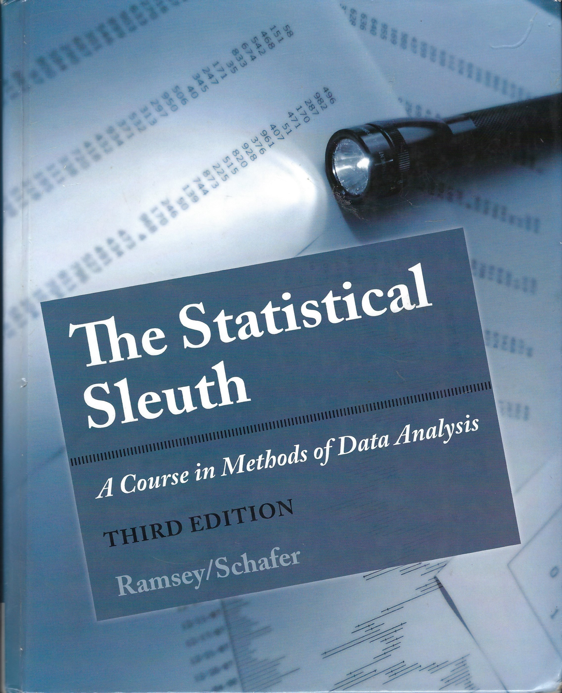
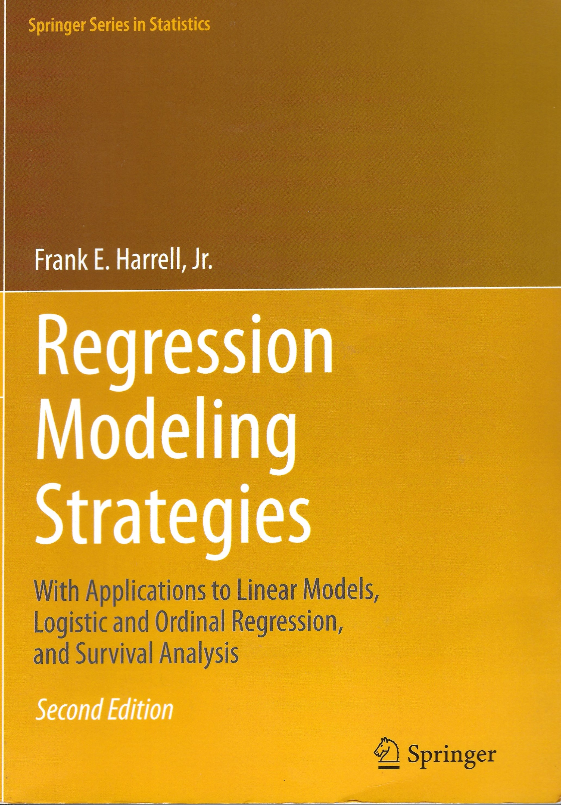
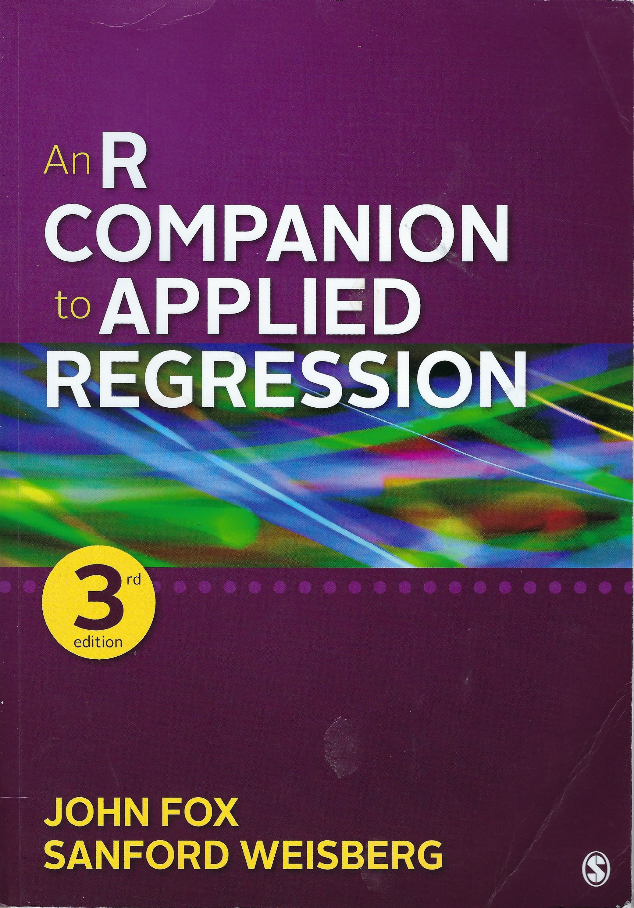
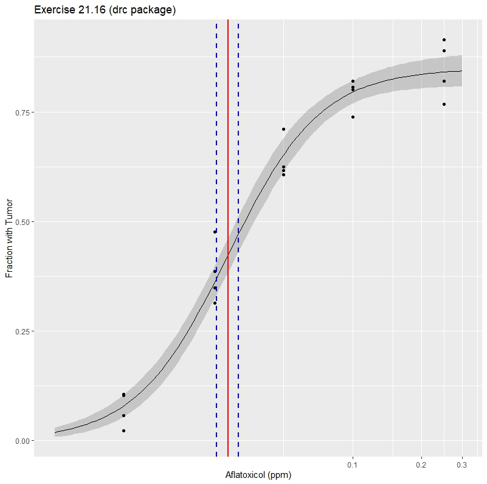
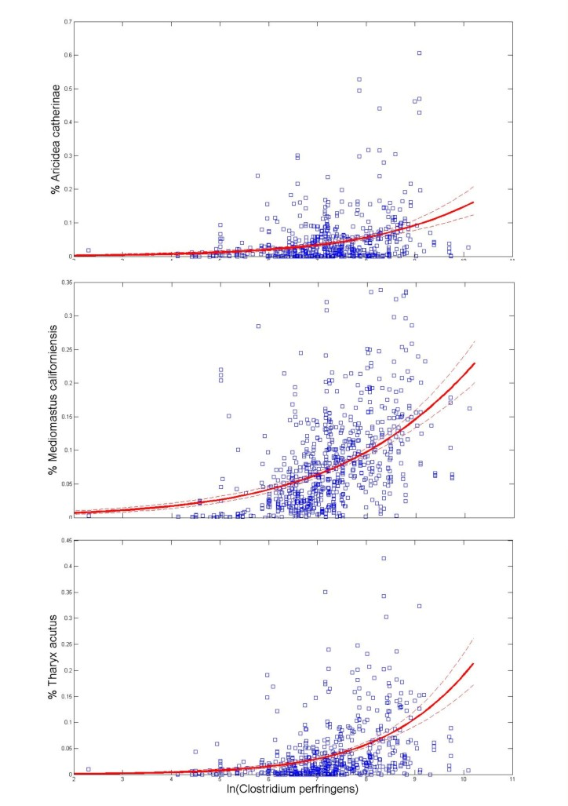

```{r setup, include=FALSE}
knitr::opts_chunk$set(echo = TRUE)
library(aplpack)
library(broom)
library(car)
library(dplyr)
library(drc)
library(ggformula)
library (Hmisc) # for Titanic and Elinder & Erixson analysis
library(mosaic)
library(rms)  # For Titanic & Elinder & Erixson analysis
library(rpart) # For Titanic analysis, recursive partitioning package
library(Sleuth3)
library (tidyverse)
library(tinytex) # from Xie et al. 2021, needed for Harrel's Titanic latex, but not working

# elogit function needed for Adam Loy's 20.2 birdkeeping example
elogit <- function(x, y, nbins) 
{
  if (is.factor(y)) y <- ifelse(y==levels(y)[2], 1, 0)
  # STEP 1
  # create "nbins" number of equal-length bins using x values
  brks <- hist(x, breaks = seq(min(x), max(x), l = nbins + 1), plot = F)$breaks
  
  # get the midpoint x value for each bin 
  midpt.x <- hist(x, breaks = seq(min(x), max(x), l = nbins + 1), plot = F)$mid
  
  # STEP 2:
  # cut command: assign each data point to one of the bins, using right interval inclusion and including minimum x value in the lowest bin
  groups <- cut(x, breaks = brks, include.lowest = T)
  
  # number of cases that fall in each bin
  groups.n <- table(groups)
 
   # STEP 3: 
  # get the empirical prop. of successes in each group
  emp.prop <- (tapply(y, groups, sum) + .5) / (groups.n + 1)
  
  # empirical odds of successes in each group
  emp.odds<- emp.prop/(1-emp.prop)
  
  # empirical log odds of successes in each group
  emp.logodds <- log(emp.odds)
  
  RES <- data.frame(group = names(groups.n),
                    count = as.numeric(groups.n),
                    midpoint.x = midpt.x,
                    eprob = as.numeric(emp.prop),
                    eodds = as.numeric(emp.odds),
                    elogit = as.numeric(log(emp.odds)))
  RES
}

```


# Key Statistics Books for Today's Class

```{r, echo= FALSE, out.width='33%', fig.align='left',fig.cap='Ramsey & Schafer (2013)'}

```

```{r, echo= FALSE, out.width='33%', fig.align='center',fig.cap='Harrell (2015)'}

```

```{r, echo= FALSE, out.width='33%', fig.align='right',fig.cap='Fox & Weisberg (2019)'}

```

***

# Chapter 20 Logistic Regression for Binary Response Variables

## Case Studies

### Case Study 20.1 Survival in the Donner Party---An Observational Study

* 1846: Donner & Reed family left Springfield MO for California

* 87 people, 27 wagons

* Stranded in the Eastern Sierra mountains in October 1846

* 40 of the 87 members had died when party rescued on April 21, 1847

* Were females better able to survive cold than males?

* <span style="color: red"> _Statistical Summary_ Odds of a female surviving were 4.9 times that of a male. </span>

***


### Notes on Binary Logistic Regression

* Dependent variable can take only two states

* Explanatory variables can be categorical or continuous (age, years of smoking)

* Logistic regression is one type of generalized linear model

  +  “A Generalized Linear Model (GLM) is a probability model in which the mean of a response variable is related to explanatory variables through a regression equation.” p. 568 [Introduced by Fisher, but term coined by Nelder & Wederburn 1972)
  
  + Generalized linear models are fit using maximum likelihood, NOT ordinary least squares (but OLS == max
likelihood if assumptions met)

* A parameter-fitting procedure is used to find the parameter estimates (e.g., scoring method, Newton-Raphson, Fisher ‘35)

* Available in R, SPSS and Matlab

***


***


***


***


***


***


***


***


***


***


***

#### Ramsey & Schafer's Code

```{r RScs2001_1}
options(digits = 3)
trellis.par.set(theme = col.mosaic())

data(case2001, package="Sleuth3")
str(case2001)
attach(case2001)
```

##### EXPLORATION AND MODEL BUILDING

```{r RScs2001_2}
myPointCode   <- ifelse(Sex=="Female",22,24)
myPointColor  <- ifelse(Sex=="Female","green","orange")
survivalIndicator <- ifelse(Status=="Survived",1,0)
jFactor <- 0.1   # jittering factor
plot(jitter(survivalIndicator,jFactor) ~ jitter(Age, jFactor),
     pch=myPointCode, bg=myPointColor, cex=1.5)
# Logistic regression. Start with a rich model; use backward elimination
ageSquared <- Age^2
myGlm1 <- glm(Status ~ Age + ageSquared + Sex + Age:Sex + ageSquared:Sex, 
              family=binomial)
# Use backward elimination, but remove interaction and squared terms 1st 
summary(myGlm1)
myGlm2 <- update(myGlm1, ~ . - ageSquared:Sex)
summary(myGlm2)
myGlm3 <- update(myGlm2, ~ . - ageSquared)
summary(myGlm3)   # Wald test p-value for interaction of Age and Sex is: 0.0865
# More accurate likelihood ratio (drop in deviance) test:
myGlm4 <-update(myGlm3, ~ . - Age:Sex)
anova(myGlm4, myGlm3)  # Drop-in-deviance chi-square stat = 3.9099 on 1 d.f.
1 - pchisq(3.9099,1)  # 2-sided p-value = 0.048
```

##### INFERENCE AND INTERPRETATION

```{r RScs2001_3}
# Proceed by ignoring interaction (for a casual and approximate analysis) 
myGlm5  <- update(myGlm4, ~ . - Sex)
anova(myGlm5, myGlm4) # Drop-in-deviance chi-square statistic = 5.0344 on 1 d.f.
1 - pchisq(5.0344,1)  # 2-sided p-value 0.02484869: Highly suggestive  
0.0248869/2  # 1-sided p-value = half the 2-sided p-value = 0.01244345
# Interpretation and confidence interval
Sex <- factor(Sex,levels=c("Male","Female")) # Reorder levels so "Male" is ref 
myGlm4b <- glm(Status ~ Age + Sex, family=binomial)
beta <- myGlm4b$coef
exp(beta[3]) # 4.939645 
exp(confint(myGlm4b,3))  # 25.246069  1.215435 
# Interpretation: The odds of survival for females are estimated to be 5 times 
# the odds of survival of similarly-aged mean (95% CI: 1.2 times to 25.2 times).
```

##### GRAPHICAL DISPLAY FOR PRESENTATION

```{r RScs2001_4}
myPointCode <- ifelse(Sex=="Female",22,24)
myPointColor <- ifelse(Sex=="Female","green","orange")
myLineColor <- ifelse(Sex=="Female","dark green","blue")
survivalIndicator <- ifelse(Status=="Survived",1,0)
jFactor <- 0.1
plot(jitter(survivalIndicator,jFactor) ~ jitter(Age, jFactor),
     ylab="Estimated Survival Probability", xlab="Age (years)",
     main=c("Donner Party Survival by Sex and Age"), xlim=c(15,75),   
     pch=myPointCode, bg=myPointColor, col=myLineColor, cex=2, lwd=3)
beta            <- myGlm4b$coef
dummyAge        <- seq(15,65,length=50)
linearMale      <- beta[1] + beta[2]*dummyAge  #log odds of survival for males
linearFemale    <- linearMale + beta[3] #log odds of survival for females
pCurveMale      <- exp(linearMale)/(1 + exp(linearMale) ) # survival prob; males
pCurveFemale    <- exp(linearFemale)/(1 + exp(linearFemale)) # females
lines(pCurveMale ~ dummyAge,lty=2,col="blue",lwd=3)
lines(pCurveFemale[dummyAge <= 50] ~ dummyAge[dummyAge <= 50],lty=1,
      col="dark green",lwd=3)

legend(63,.5,legend=c("Females","Males"), pch=c(22,24),
       pt.bg = c("green","orange"), pt.cex=c(2,2), lty=c(1,2), lwd=c(3,3),
       col=c("dark green","blue"))
text(72,1,"Survived (20)")
text(72,0,"Died (25)")
detach(case2001)
```

***


***

#### Adam Loy's (Carleton College) TidySleuth version of 20.1

```{r RScs2001_tidy TidySleuth, include=FALSE, warning=FALSE}
elogit <- function(x, y, nbins) 
{
  if (is.factor(y)) y <- ifelse(y==levels(y)[2], 1, 0)
  # STEP 1
  # create "nbins" number of equal-length bins using x values
  brks <- hist(x, breaks = seq(min(x), max(x), l = nbins + 1), plot = F)$breaks
  
  # get the midpoint x value for each bin 
  midpt.x <- hist(x, breaks = seq(min(x), max(x), l = nbins + 1), plot = F)$mid
  
  # STEP 2:
  # cut command: assign each data point to one of the bins, using right interval inclusion and including minimum x value in the lowest bin
  groups <- cut(x, breaks = brks, include.lowest = T)
  
  # number of cases that fall in each bin
  groups.n <- table(groups)
   # STEP 3: 
  # get the empirical prop. of successes in each group
  emp.prop <- (tapply(y, groups, sum) + .5) / (groups.n + 1)
  
  # empirical odds of successes in each group
  emp.odds<- emp.prop/(1-emp.prop)
  
  # empirical log odds of successes in each group
  emp.logodds <- log(emp.odds)
  
  RES <- data.frame(group = names(groups.n),
                    count = as.numeric(groups.n),
                    midpoint.x = midpt.x,
                    eprob = as.numeric(emp.prop),
                    eodds = as.numeric(emp.odds),
                    elogit = as.numeric(log(emp.odds)))
  RES
}
```

```{r eval=TRUE}
# display four significant digits by default and no significance stars
options(digits = 4, show.signif.stars = FALSE) 
```

For any given age, were the odds of survival in the Donner Party greater for women than men? This is the question addressed in case study 20.1 in the *Sleuth*.

##### Summary statistics

We begin by reading the data (which is done when you loaded the Sleuth3 package) and exploring the relationships between age, sex, and survival status.

```{r}
summary(case2001)
```

To begin exploring the relationship between `Status` and `Age` we can construct side-by-side boxplots

```{r }
gf_boxplot(Age ~ Status, data = case2001) %>%
  gf_refine(coord_flip())
```

We see that younger adults were more likely to survive. We can dig a little deeper into this association by creating a conditional density plot, where the conditional distribution of survival status given age is plotted:

```{r}
# cdplot is part of R's base graphics
# ?cdplot
cdplot(Status ~ Age, data = case2001)
```


The conditional density plot supports the claim that younger adults seem more likely to survive.

To explore the relationship between `Status` and `Sex` we can construct a spine plot, where the conditional distribution of survival is displayed by sex.

```{r}
# ?spineplot
spineplot(Status ~ Sex, data = case2001)
```

*Note:* In order for our results to match those presented in the *Sleuth* we must reorder the levels of `Status`, making `Male` the reference/baseline level. This is easily done using the `relevel()` command:

```{r}
case2001$Sex <- relevel(case2001$Sex, ref = "Male")
```

The following code presents the results interpreted on page 608 and presented in Display 20.6 (on page 614):

```{r}
# Parallel lines model
donner_mod1 <- glm(Status ~ Age + Sex, data = case2001, family = binomial) 
summary(donner_mod1)
```

A logistic regression model with an interaction term between age and sex is considered in Display 20.5 (on page 613). This model is fit using the code below:

```{r}
# Separate lines model
donner_mod2 <- glm(Status ~ Age * Sex, data = case2001, family = binomial)
summary(donner_mod2)
```

##### Inferential tools

First, Display 20.5 (on page 613) details how to carry out Wald's test for $\beta_{\rm age \times sex} = 0$ from the second model. Notice that you can use the output from `summary(donner_mod2)` to conduct this test.

Next, the *Sleuth* builds a confidence interval for $\beta_{\rm fem}$ from the parallel lines model (i.e. model 1). This **is not** the confidence interval returned by `confint()`, so it must be constructed by hand. Remember that the model coefficients are on the log-odds scale, be sure to back-transform in order to obtain interpretations on the odds scale!

```{r}
beta_fem <- coef(donner_mod1)[3]
se_fem <- sqrt(vcov(donner_mod1)[3,3])
upper <- beta_fem + qnorm(.975) * se_fem
upper
lower <- beta_fem - qnorm(.975) * se_fem
lower
exp(upper)
exp(lower)
```

A more-reliable confidence interval for the coefficients can be obtained using the theory of the drop-in deviance test. This profile-likelihood confidence interval is obtained for all of the coefficients below:

```{r}
CIs <- confint(donner_mod1, level = 0.95)
CIs

# Backtransform to compare to the interval above
exp(CIs[3,]) 
```

Notice that the intervals may disagree. Here the normal distribution gives the interval (1.124, 21.71) while the profile-likelihood confidence interval is (1.215, 25.246). 

***

### Case Study 20.2 Birdkeeping and Lung Cancer---A Retrospecitive Observational Study

#### Notes on 20.2 

* 1972-1981 Health survey of the Hague discovered an association between birdkeeping and lung
cancer

* Case-control study conducted

  + 49 cases of lung cancer identified
  + 98 controls selected from the same general population
  + A retrospective product binomial sampling scheme
  
* After controlling for age and smoking, is there an increased risk of cancer from birdkeeping?

* <span style="color: red"> _Statistical Summary_ Odds of a birdkeeper getting cancer 4.1 times greater than non-birdkeeper</span>

***

#### Variables

* Response variable: Lung cancer

* Explanatory variables

  + Sex

  + Age

  + Socioeconomic status

  + YR Years of smoking

  + CD Avg rate of smoking

  + BK indicator of birdkeeping
  


***


***

#### Ramsey & Schafer's Code

```{r RScs2002_1}
# RScs2002_3rd.r
# Copied from Sleuth3 manual
# Revised 11/16/21
str(case2002)
attach(case2002)
```

##### EXPLORATION AND MODEL BUILDING

```{r RScs2002_2, warning = FALSE}
myCode <- ifelse(BK=="Bird" & LC=="LungCancer","Bird & Cancer", 
                 ifelse(BK=="Bird" & LC=="NoCancer","Bird & No Cancer",
                        ifelse(BK=="NoBird" & LC=="LungCancer","No Bird & Cancer", "No Bird & No Cancer")))
table(myCode)

# scatterplot from the car library
scatterplotMatrix(cbind(AG,YR,CD), groups=myCode, diagonal="none",reg.line=FALSE,
                    pch=c(15,21,15,21), col=c("dark green","dark green","purple","purple"),
                    var.labels=c("Age","Years Smoked","Cigarettes per Day"), cex=1.5) 

# Reorder the levels so that the model is for log odds of cancer
LC    <- factor(LC, levels=c("NoCancer","LungCancer"))    
myGlm <- glm(LC ~ FM + SS + AG + YR + CD + BK, family=binomial)
if(require(car)){   # Use the car library
  crPlots(myGlm)  }
# It appears that there's an effect of Years of Smoking and of Bird Keeping
# after accounting for other variables; no obvious effects of other variables

# Logistic regression model building using backward elimination (withholding BK)
myGlm1 <- glm(LC ~ FM + SS + AG + YR + CD, family=binomial)
summary(myGlm1)
myGlm2 <- update(myGlm1, ~ . - SS)        
summary(myGlm2)
myGlm3 <- update(myGlm2, ~ . - CD)   
summary(myGlm3)
myGlm4 <- update(myGlm3, ~ . - FM)   
summary(myGlm4) # Everything left has a small p-value (retain the intercept)
```

##### INFERENCE AND INTERPRETATION

```{r RScs2002_3}
myGlm5 <- update(myGlm4, ~ . + BK)    # Now add bird keeping
summary(myGlm5)
myGlm6 <- update(myGlm5, ~ . + BK:YR + AG:YR) # Try interaction terms
anova(myGlm6,myGlm5) # Drop-in-deviance = 1.61 on 2 d.f.
1 - pchisq(1.61,2)    # p-value = .45: no evidence of interaction
anova(myGlm4,myGlm5)   # Test for bird keeping effect
(1 - pchisq(12.612,1))/2  # 1-sided p-value: 0.0001916391

BK <- factor(BK, levels=c("NoBird", "Bird"))  # Make "no bird" the ref level
myGlm5b <- glm(LC ~ AG + YR + BK, family=binomial)   
beta <- myGlm5b$coef  # Extract estimated coefficients
exp(beta[4])   # 3.961248                
exp(confint(myGlm5b,4))   # 1.836764 8.900840  
# Interpretation: The odds of lung cancer for people who kept birds were 
# estimated to be 4 times the odds of lung cancer for people of similar age, sex, 
# smoking history, and socioeconomic status who didn't keep birds
# (95% confidence interval for this adjusted odds ratio: 1.8 times to 8.9 times).

detach(case2002)
```

#### Adam Loy's (Carleton College) TidySleuth version of 20.2 Birdkeeping and Lung Cancer

After controlling for age, socioeconomic status and smoking, is an additional risk of lung cancer associated with birdkeeping? This is the question addressed in case study 20.2 in the *Sleuth*.

##### Summary statistics

We begin by reading the data and recoding a few variable so that they match the coding using in the *Sleuth*.


```{r}
summary(case2002)
# Adjust the coding to match Sleuth's
case2002 <- case2002 %>%
  mutate(LC = relevel(LC, ref = "NoCancer"),
         FM = relevel(FM, ref = "Male"),
         SS = relevel(SS, ref = "Low"),
         BK = relevel(BK, ref = "NoBird"))
```

Next, we create a coded (and faceted) scatterplot of years of smoking against age, where the plotting symbols are used to represent lung cancer status (Display 20.10, page 621):

```{r}
gf_point(YR ~ AG | BK:LC, shape = ~LC, data = case2002) %>%
  gf_refine(theme(legend.position = "none"))
```

##### The drop-in-deviance test

The goal of this case study is to see whether birdkeeping is associated with increased odds of lung cancer after accounting for several other factors. To do this, the *Sleuth* conducts a likelihood ratio test, also referred to as a drop-in-deviance test. In order conduct this test we need a full and reduced model, just like for an extra-sum-of-squares $F$-test for regression.

The full model from Display 20.7 (on page 616) is fitted below:

```{r}
full_model <- glm(LC ~ FM + AG + SS + YR + BK, data = case2002, family = binomial)
full_model
```

The reduced model from Display 20.7 (on page 616) is fitted below: 

```{r}
reduced_model <- glm(LC ~ FM + AG + SS + YR, data = case2002, family = binomial)
reduced_model
```

The drop-in-deviance test can be conducted by hand, as shown below:

```{r}
# test statistic
dd_stat <- deviance(reduced_model) - deviance(full_model)
dd_stat

# d.f.
df <- df.residual(reduced_model) - df.residual(full_model)
df

# p-value
1 - pchisq(dd_stat, df = 1)
```

Alternatively, it can be conducted using the `anova()` command:

```{r}
anova(reduced_model, full_model, test = "Chisq")
```

##### Examining linearity

As mentioned in passing on page 620, we can check whether the relationship between the logit and a quantitative predictor is linear by using the sample (empirical) logit. The setup code-chunk in this r markdown document defines the function `elogit()` which calculates the empirical logit and produces a data frame for plotting. You can copy and paste this code, or load it using the following code:

```{r}
# source("http://aloy.rbind.io/r/empiricalLogit.R")  # dead link
```

Once you have this function, you can reproduce Display 20.11:

```{r}
# The following statement, referring to the elogit code in setup, produced an error
# sample_logit <- elogit(case2002$YR, case2002$LC, breaks = c(0, 1, 20, 30, 40, 50))
sample_logit <- elogit(case2002$YR, case2002$LC, nbins=5)
gf_point(elogit ~ midpoint.x, data = sample_logit) %>%
  gf_labs(x = "Years smoked (midpoint of interval)", y = "Sample Logit")
```

Note: if you are not sure what intervals to use, but know the number of intervals desired, you can specify `nbins` rather than `breaks` in the `elogit()` function.

***


***


***


***

# Chapter 21 Logistic Regression for Binomial Counts

## Case Studies

### Case Study 21.1 Island Size and Bird Extinctions 

#### Ramsey & Schafer's Code

```{r RScs2101_1}
str(case2101)
attach(case2101)
# fix(case2101) # I don't know why this statement is in the vignette code
```

##### EXPLORATION AND MODEL BUILDING

```{r RScs2101_2}
proportionExtinct <- Extinct/AtRisk
oddsExtinct  <- proportionExtinct/(1 - proportionExtinct)
logitExtinct <- log(oddsExtinct)   # Logit = Log Odds
logArea <- log(Area)
plot(logitExtinct ~ logArea,xlab="log (Area)",ylab="logit (Extinct)")

binResponse  <- cbind(Extinct,AtRisk-Extinct)
myGlm1 <- glm(binResponse ~ logArea, family=binomial)
summary(myGlm1)
logArea2 <- logArea^2
myGlm2 <- update(myGlm1, ~ . + logArea2)
summary(myGlm2) # p-value for quadratic term: 0.77
```

##### INFERENCE AND INTERPRETATION

```{r RScs2101_3}
myGlm3 <- update(myGlm1, ~ . - logArea)
anova(myGlm3, myGlm1) # Drop in deviance statistic = 33.277 on 1 d.f.
1 - pchisq(33.277,1) # p-value = 7.992234e-09
beta <- myGlm1$coef
1 - 2^beta[2]  # 0.1861153
1 - 2^confint(myGlm1,2) #0.2462041 0.1247743 
# Interpretation: Associated with each doubling of island area is a 19% 
# reduction in the odds of extinction (95% confidence interval: 12% to 25% 
# reduction).
```

##### GRAPHICAL DISPLAY FOR PRESENTATION 

```{r RScs2101_4}
plot(oddsExtinct ~ Area, log="xy", ylab="Observed Odds of Extinction; log scale",
     xlab=expression(paste("Island Area (km"^"2","); log scale")),
     main="Extinctions of Bird Species in the Krunnit Island Archipelago",
     pch=21, lwd=2, bg="green", cex=2)   # Plot odds of extinction vs island area
dummyArea <- seq(min(Area),max(Area),length=50)
lp <- beta[1] + beta[2]*log(dummyArea)
odds <- exp(lp)
lines(odds ~ dummyArea,lwd=2)

plot(proportionExtinct ~ Area, log="xy", 
     ylab="Proportions of 1949 Species not Found in 1959",
     xlab=expression(paste("Island Area (km"^"2","); log scale")),
     main="Proportions of 1949 Bird Species Extinct in 1959 on 18 Krunnit Archipelago Islands",
     pch=21, lwd=2, bg="green", cex=2)  # Plot probability of extinction vs area
dummyArea  <- seq(min(Area),max(Area),length=50)
lp <- beta[1] + beta[2]*log(dummyArea)
myProbability <- exp(lp)/(1 + exp(lp))
lines(myProbability ~ dummyArea,lwd=2,col="blue")
legend(.08,.055,legend="Estimated Probability of Extinction",lty=1,lwd=2,col="blue")
detach(case2101)
```

#### Adam Loy's (Carleton College) TidySleuth version of 21.1 Island Size and Bird Extinctions

##### Introduction

This document is intended to help describe how to undertake analyses introduced as examples in the Third Edition of the *Statistical Sleuth* (2013) by Fred Ramsey and Dan Schafer. More information about the book can be found at http://www.proaxis.com/~panorama/home.htm.  

In this chapter we need to load the following packages (remember, you will need to install packages you have never used before if you are using your own computer).

We will set some options to improve legibility of graphs and output.
```{r eval=TRUE}
# display four significant digits by default and no significance stars
options(digits = 4, show.signif.stars = FALSE) 
```

##### Exploratory Data Analysis

Calculating the proportions and empirical logits...

```{r}
case2101 <- case2101 %>%
  mutate(prop = Extinct / AtRisk, 
         logit = log((Extinct + 0.5) / (AtRisk - Extinct + 0.5)))
head(case2101)
```


```{r display 21.2}
gf_point(logit ~ Area, data = case2101) %>%
  gf_refine(coord_trans(x="log10")) %>%
  gf_labs(x = "Area (sq. km, log scale)", y = "Logit")
```

##### Fitting a logistic regression model

```{r display 21.6}
island_glm1 <- glm(prop ~ log(Area), data = case2101,
                   family = binomial, weights = AtRisk)
summary(island_glm1)
```


##### Examining residuals

```{r display 21.5}
# This produces an error, probably because of a conflict with drc, so I'm
# deleting int.
# island_resids <- case2101 %>%
#  select(Island, prop) %>%
#  mutate(raw.resid = resid(island_glm1, type = "response"),
#         pearson.resid = resid(island_glm1, type = "pearson"),
#         dev.resid = resid(island_glm1, type = "deviance"))
# head(island_resids)
```

##### Deviance goodness-of-fit test

```{r}
deviance(island_glm1)
df.residual(island_glm1)
1 - pchisq(12.06, df = 16)
```

Note: the deviance statistic can also be found are the "Residual deviance" in the summary of the fitted logistic regression model. (You should look at the summary above to verify this.)

##### Inference about model coefficients

```{r display 21.7}
tidy(island_glm1)
```

```{r}
beta1 <- coef(island_glm1)[2]
beta1

se <- sqrt(vcov(island_glm1)[2,2])
se

beta1 + c(-1, 1) * qnorm(.975) * se
```

Drop-in-deviance test

```{r}
island_reduced <- update(island_glm1, . ~ . - log(Area))
anova(island_reduced, island_glm1, test = "Chisq")
```

***

### Case Study 21.2 Moth Coloration and Natural Selection 

#### Ramsey & Schafer's Code

```{r RScs2102_1}
# RScs2102_3rd.r
# Copied directly from the Sleuth3 manual, part of the Sleuth3 package
 # Eugene.Gallagher@umb.edu 1/11/2013
str(case2102)
attach(case2102)
```

##### EXPLORATION  AND MODEL BUILDING

```{r RScs2102_2}
proportionRemoved <- Removed/Placed
myPointCode <- ifelse(Morph=="dark",21,22)
myPointColor <- ifelse(Morph=="dark","blue","gray")
plot(proportionRemoved ~ Distance, pch=myPointCode, bg=myPointColor, cex=2, lwd=2)

binResponse <- cbind(Removed, Placed-Removed)
Morph <- factor(Morph, levels=c("light","dark"))  # Make "light" the ref  level
myGlm1 <- glm(binResponse ~ Distance + Morph + Distance:Morph, family=binomial)
summary(myGlm1)  # Residual deviance:  13.230  on 10  degrees of freedom
1 - pchisq(13.230,10)  # No evidence of overdispersion
myGlm2  <- update(myGlm1, ~ . - Distance:Morph)
anova(myGlm2, myGlm1) # Drop in deviance statistic = 11.931 on 1 d.f.
1 - pchisq(11.931,1)  # p-value = 0.0005520753 => strong evidence of interaction
# It appears that the intercepts are the same for both light and dark morphs, 
# that there is no effect of Distance for light morphs, but there is an effect 
# of Distance for dark morphs.
```

##### INFERENCE AND INTERPRETATION

```{r RScs2102_3}
myTerm  <- Distance*ifelse(Morph=="dark",1,0) # Create indicator var for "dark"
myGlm3 <- glm(binResponse ~ myTerm, family=binomial)
summary(myGlm3)
```

##### GRAPHICAL DISPLAY FOR PRESENTATION

```{r RScs2102_4}
myPointCode <- ifelse(Morph=="dark",22,24)
myPointColor  <- ifelse(Morph=="dark","blue","orange")
plot(proportionRemoved ~ Distance, ylab="Proportion of Moths Taken",
     main="Proportions of Moths Taken by Predators at Seven Locations",
     xlab="Distance from Liverpool (km)", pch=myPointCode, bg=myPointColor, cex=2, 
     lwd=2) 
beta  <- myGlm3$coef
dummyDist <- seq(0,55,length=50)
lp <- beta[1] + beta[2]*dummyDist
propDark <- exp(lp)/(1 + exp(lp))
lines(propDark ~ dummyDist,lwd=2,col="blue")
propLight <- rep(exp(beta[1])/(1 + exp(beta[1])),length(dummyDist))
lines(propLight ~ dummyDist,lwd=2,col="orange")  
legend(0,0.47,legend=c("Dark Morph","Light Morph"),
       pch=c(22,24),pt.bg=c("blue","orange"),pt.cex=c(2,2),pt.lwd=c(2,2))
detach(case2102)
```

#### Adam Loy's (Carleton College) TidySleuth version of 21.2 Moth Coloration and Natural Selection---A Randomized Experiment

##### Exploratory Data Analysis

Calculating the proportions and empirical logits...

```{r}
case2102 <- case2102 %>%
  mutate(prop = Removed / Placed,
         logit = log((Removed + 0.5) / (Placed - Removed + 0.5)))
head(case2102)
```

```{r display 21.4}
gf_point(logit ~ Distance, data = case2102, color = ~Morph) %>%
  gf_line() %>%
  gf_refine(scale_color_brewer(palette = "Set2")) %>%
  gf_labs(x = "Distance (km) from Liverpool",
          y = "Logit")
```

***

# Supplemental Analyses on Binary & Binomial Logistic Regression

## Dose-Response Curves with the DRC package

Ritz, C., F. Baty, J. C. Streibig, and D. Gerhard. 2015. Dose-response analysis using R. PLOS One 10(12): e0146021.

```{r, warning = FALSE}
# ecotox_drc_binomial
# drc analysis for ecotoxicology data on earthworm movement.
# dose-response package
# Program adapted by Eugene.Gallagher@umb.edu 11/3/21
# I think the S1 file has these reversed. In the 1st model the upper limit was 
# estimated. In the lower model, the upper limit d was set at 0.5
## Fitting an extended logistic regression model
## where the upper limit is estimated
earthworms.m1 <- drm(number/total ~ dose, weights = total, data = earthworms,
                     fct = LL.3(), type = "binomial")
summary(earthworms.m1)
confint(earthworms.m1)
##
## Model fitted: Log-logistic (ED50 as parameter) with lower limit at 0 (3 parms)
##
## Parameter estimates:
## Fitting an extended logistic regression model
## where the upper limit is fixed at 0.5
earthworms.m2 <- drm(number/total ~ dose, weights = total, data = earthworms,
                     fct = LL.3(fixed = c(NA, 0.5, NA)), type = "binomial")
summary(earthworms.m2)
options(digits=3)
confint(earthworms.m2)
##
## Model fitted: Log-logistic (ED50 as parameter) with lower limit at 0 (2 parms)
##
## Parameter estimates:
##
## Estimate Std. Error t-value p-value
## b:(Intercept) 1.646689 0.376494 4.373742 0
## e:(Intercept) 0.377269 0.076785 4.913299 0
# e is the ED50
# Plot the analyses
plot(earthworms.m1, broken = TRUE, type = "all",
     xlab = "Toxic substance", xlim = c(0, 100),
     ylab = "% Remaining")
# new dose levels as support for the line
newdata <- expand.grid(dose=exp(seq(log(0.005), log(10), length=100)))
# predictions and confidence intervals
pm <- predict(earthworms.m1, newdata=newdata, interval="confidence")
# new data with predictions
newdata$p <- pm[,1]
newdata$pmin <- pm[,2]
newdata$pmax <- pm[,3]
# plot curve
library(ggplot2)
# need to shift conc == 0 a bit up, otherwise there are problems with coord_trans
earthworms$dose0 <- earthworms$dose
earthworms$dose0[earthworms$dose == 0] <- 0.005
# plotting the curve
ggplot(earthworms, aes(x = dose0, y = number/total)) +
  geom_point() +
  geom_ribbon(data=newdata, aes(x=dose, y=p, ymin=pmin, ymax=pmax), alpha=0.2) +
  geom_line(data=newdata, aes(x=dose, y=p)) +
  coord_trans(x="log") +
  geom_vline(xintercept = 0.3773, linetype="dashed", 
              color = "blue", size=1) +
  xlab("Ethylene glycol") + ylab("% Germinating") # Labels changed for EnvSci121
options(digits=5)
```

## Logistic Model Case Study: Survival of Titanic Passengers (Harrell (2015) Ch 9 & May 2021 Short Course)

### 9.1 Descriptive statistics

```{r}
# options (prType ='latex') # for print, summary, anova # latex not working
getHdata (titanic3) # get dataset from Harrell's Vanderbilt website
# List of names of variables to analyze
v  <- c('pclass','survived','age','sex','sibsp','parch')
t3 <- titanic3 [, v]
units(t3$age) <- 'years '
# latex(describe (t3), file ='')  # Couldn't get latex to work
describe(t3, file ='')
```

```{r}
dd <-  datadist (t3)
# describe distributions of variables to rms
options ( datadist ='dd')
# parch is the number of Parents/Children abouard
s <-  summary (survived ~ age + sex + pclass +
                cut2 (sibsp ,0:3) + cut2 (parch,0:3), data =t3)
plot (s, main ='', subtitles = FALSE ) # Figure 9.1
```

Figure 9.1: Univariable summaries of Titanic survival

#### Show 4-way relationships after collapsing levels. Suppress estimates based on
# < 25 passengers.
```{r}
tn  <- transform (t3 ,
                agec = ifelse (age < 21, 'child', 'adult'),
                sibsp = ifelse (sibsp == 0, 'no sib/sp', 'sib/sp'),
                parch = ifelse (parch == 0, 'no par/ child', 'par/child'))
g <-  function (y) if( length (y) < 25) NA else mean (y)
s <-  with (tn , summarize ( survived,
                           llist (agec, sex, pclass, sibsp, parch), g))
# llist , summarize in Hmisc package
# Figure 9.2:
ggplot ( subset (s, agec != 'NA '),
         aes(x= survived , y=pclass, shape =sex)) +
  geom_point () + facet_grid ( agec ~ sibsp * parch ) +
  xlab ('Proportion Surviving') + ylab ('Passenger Class') +
  scale_x_continuous (breaks =c(0, .5 , 1))
```

Figure 9.2: Multi-way summary of Titanic survival

### 9.2 Exploring Trends with Nonparametric Regression

```{r}
# Figure 9.3
b <-  scale_size_discrete (range =c(.1 , .85))
```

```{r}
yl  <- ylab (NULL)
p1  <- ggplot (t3, aes(x=age , y= survived )) +
  histSpikeg ( survived ~ age , lowess =TRUE , data =t3) +
  ylim (0 ,1) + yl
p2  <- ggplot (t3 , aes(x=age , y= survived , color =sex)) +
  histSpikeg ( survived ~ age + sex , lowess =TRUE ,
               data =t3) + ylim (0 ,1) + yl
p3  <- ggplot (t3 , aes(x=age , y= survived , size = pclass )) +
  histSpikeg ( survived ~ age + pclass , lowess =TRUE ,
               data =t3) + b + ylim (0 ,1) + yl
p4  <- ggplot (t3 , aes(x=age , y= survived , color =sex ,
                      size = pclass )) +
  histSpikeg ( survived ~ age + sex + pclass ,
               lowess =TRUE , data =t3) +
  b + ylim (0, 1) + yl
gridExtra :: grid.arrange (p1, p2, p3, p4, ncol =2) # combine 4
```

Figure 9.3: Nonparametric regression (loess) estimates of the relationship between age and the probability of surviving the Titanic, with tick marks depicting the age distribution. The top left panel shows unstratified
estimates of the probability of survival. Other panels show nonparametric estimates by various stratifications.

Table 9.1: Wald statistics for survived

```{r}
# Figure 9.4
top <-theme (legend.position ='top')
p1 <-   ggplot (t3 , aes(x=age , y= survived , color = cut2(sibsp,
              0:2) )) + stat_plsmo () + b + ylim (0, 1) + yl + top +
              scale_color_discrete (name ='siblings/spouses')
p2  <- ggplot (t3 , aes(x=age , y= survived , color = cut2 (parch,
              0:2) )) + stat_plsmo () + b + ylim (0 ,1) + yl + top +
             scale_color_discrete (name ='parents/children')
gridExtra :: grid.arrange (p1, p2 , ncol =2)
```

Figure 9.4: Relationship between age and survival stratified by the number of siblings or spouses on board (left panel) or by the number of parents or children of the passengers on board (right panel).

### 9.3 Binary Logistic Model with Casewise Deletion of Missing Values

First fit a model that is saturated with respect to age, sex, pclass. Insuffcient variation in sibsp, parch to fit complex interactions or nonlinearities. [Note the use of restricted cubic spline rcs for age]

```{r}
f1  <-  lrm(survived ~ sex * pclass * rcs(age, 5) +
            rcs(age, 5) * (sibsp + parch), data = t3) # Table 9.1

print(anova (f1), table.env = TRUE, label ='titanic - anova3', size ='small')
anova(f1)  # can't find the error in these lines
```

3-way interactions, parch clearly insignificant, so drop

```{r}
f <- lrm( survived ~ (sex + pclass + rcs(age, 5))^2 +
           rcs(age,5)*sibsp, data =t3)
print (f) # finding errors
```

```{r}
print(anova(f), table.env =TRUE, label ='titanic-anova2', size ='small') #9.2
```

Show the many effects of predictors
```{r}
p <-  Predict (f,age, sex, pclass, sibsp =0, fun= plogis)
ggplot (p) # Fig. 9.5
```

Figure 9.5. Effects of predictors on probability of survival of Titanic passenters, estimated for zero siblings or spouses.

Note that children having siblings apparently had lower survival. Married adults had slightly higher survival than unmarried ones. 

Validate the model using the boostrap to check overfitting. Ingoring two very insignificant pooled tests.

```{r}
f <-  update (f, x=TRUE, y= TRUE)
# x = TRUE , y = TRUE adds raw data to fit object so can bootstrap
set.seed (131) # so can replicate re-samples
# latex (validate (f, B =200), digits =2, size ='Ssize')  #error
  latex(validate (f, B =200), digits =2, size ='Ssize')
```

```{r}
cal <-calibrate (f, B =200) # Figure 9.7
plot (cal , subtitles = FALSE )          
```

Figure 9.7. Boostrap overfitting-corrected loess nonparametric calibration curve for casewise deletion model.

But moderate problem with missing data

### 9.4 Examining Missing Data Patterns

```{r}
na.patterns <-  naclus (titanic3)
# require ( rpart ) #Recursive partitioning package, added to setup
who.na  <- rpart (is.na (age) ~ sex + pclass + survived +
                   sibsp + parch, data = titanic3 , minbucket =15)
naplot (na.patterns , 'na per var')
plot (who.na , margin =.1); text (who.na ) # Figure 9.8
plot ( na.patterns )
```

Figure 9.8 Patterns of missing data. Upper left panel shows the fraction of observations missing on each predictor. Lower panel depicts a hierarchical cluster analysis of missingness combinations. The similarity measure shown on the Y-axis is the fraction of observations for which both variables are missing. Right panel shows the results of recursive partitioning for predicting is.na(age). The rpart function found only strong patterns accourding the passenger class.

```{r}
plot (summary (is.na (age) ~ sex + pclass + survived +
                   sibsp + parch , data =t3)) # Figure 9.9
```

```{r}
m <-  lrm( is.na (age) ~ sex * pclass + survived + sibsp + parch ,
         data =t3)
print(m, needspace ='3 .5in ')  # error in print command
```

Figure 9.9 Univariable descriptions of proportion of passenges with missing age.
```{r}
print (anova(m), table.env =TRUE , label =' titanic-anova.na ') # Table 9.3
```

pclass and parch aree the important predictors of missing age.

### Single Conditional Mean Imputation


First try: conditional mean imputation
Default spline transformation for age caused distribution of imputed values to be much different from non-imputed ones; constrain to linear

```{r}
xtrans <-   transcan (~ I(age) + sex + pclass + sibsp + parch ,
                    imputed =TRUE , pl=FALSE , pr=FALSE , data =t3)
summary (xtrans)
```

```{r}
# Look at mean imputed values by sex , pclass and observed means
# age . iis age , filled in with conditional mean estimates
age.i <-  with (t3, impute (xtrans, age, data =t3))
i <-  is.imputed (age.i)
with (t3, tapply (age.i[i], list (sex[i], pclass [i]) , mean))
```

```{r}
with (t3, tapply (age, list(sex, pclass), mean , na.rm = TRUE ))
```

```{r}
dd  <- datadist (dd , age.i )
f.si <-   lrm( survived ~ (sex + pclass + rcs(age.i,5))^2 +
              rcs(age.i, 5)*sibsp, data =t3)
print (f.si, coefs = FALSE)  # error in the print function

```{r}
p1 <- Predict (f, age , pclass , sex , sibsp =0, fun= plogis )
p2 <- Predict (f.si , age.i , pclass , sex , sibsp =0, fun= plogis )
p <-  rbind ('Casewise Deletion '= p1 , 'Single Imputation '=p2,
           rename =c(age.i ='age')) # creates.set.variable
ggplot (p, groups ='sex', ylab ='Probability of Surviving')
# Figure 9.10
```

Figure 9.10: Predicted probability of survival for males from fit using casewise deletion (left) and single conditional mean imputation (right). sibsp is set to zero for thses predicted values

```{r}
print (anova (f.si), table.env =TRUE,label ='titanic-anova.si') #Table 9.4 # error
```

### 9.6 Multiple Imputation

The following uses aregImpute with predictive mean mataching. By default, aregImpute does not transform age when it is being predicted from other variabls (not needed hear as no other missings wree present). Since the fraction of observations with missing age is 263/1309 = 0.2 we use 20 imputations. 

```{r, warning=FALSE}
set.seed (17) # so can reproduce random aspects
mi  <- aregImpute (~ age + sex + pclass +
                    sibsp + parch + survived ,
                  data =t3 , n.impute =20 , nk =4, pr= FALSE ) # couldn't compute 4 knots
mi
```

Print the first 10 imputations for the first 10 passengers
```{r}
mi$imputed$age [1:10 , 1:10]
```

Show the distribution of imputed (black) and actual ages (gray).

```{r}
plot (mi)
Ecdf (t3$age , add=TRUE , col='gray ', lwd =2,
      subtitles = FALSE ) # Fig . 9.11
```

Fit logistic models for 20 completed datasets and print the ratio of imputation-corrected variances to ordinary variances

```{r}
f.mi <-   fit.mult.impute (
  survived ~ (sex + pclass + rcs(age,5))^2 +
    rcs(age ,5)*sibsp,
  lrm , mi , data =t3 , pr= FALSE )
print (anova (f.mi), table.env =TRUE , label =' titanic-anova.mi ',
        size ='small') # Table 9.5 # invalid replacement argument
```

The Wald Chi^2 for age is reduced by accounting for imputation but it is increased by using patterns of assocaiteion with survival status to impute missing age.

Show estimated effecs of age by classes

```{r}
p1  <- Predict (f.si , age.i, pclass, sex , sibsp =0, fun= plogis)
p2  <- Predict (f.mi, age, pclass, sex , sibsp =0, fun= plogis)
p   <-  rbind ('Single Imputation' =p1 , 'Multiple Imputation'=p2,
           rename =c(age.i ='age'))
ggplot (p, groups ='sex', ylab ='Probability of Surviving ')
# Figure 9.12
```

Figure 9.12: Predicted probability of survival for males from fit using single conditional mean imputation again (left) and multiple random draw impuation (right). Both sets of predictions are for sibsp = 0.

### 9.7 Summarizing the Fitted Model

Show odds ratios for changes in predictor values

```{r}
# Get predicted values for certainty types of passengers
s <-  summary (f.mi , age=c(1 ,30) , sibsp =0:1)
# override default ranges for 3 variables
plot (s, log=TRUE , main ='') # Figure 9.13
```

Figure 9.13: Odds ratios for some predictor settings

```{r}
phat <-  predict (f.mi,
                combos  <-
                expand.grid (age=c(2 ,21 ,50),sex= levels (t3$sex),
                             pclass = levels (t3$ pclass ),
                             sibsp =0) , type ='fitted')
# Can also use Predict (f.m i, age = c(2 , 21 , 50 ), sex , pclass,
# sibsp = 0 , fun = plogis) $ y h a t
options (digits =1)
data.frame(combos, phat)
```

```{r}
options(digits=5)
```

We can also get predicted values by creating an S function that will evaluate the model on demand.

```{r}
pred.logit <- Function (f.mi)
# Note: if don't defines ibsp to pred.logit, defaults to 0
# normally just type the function name tosee its body
# latex ( pred.logit , file ='', type ='Sinput', size ='small',
#         width.cutoff =49) # Not generating latex 
pred.logit
```

```{r}
# Run the newly created function
plogis (pred.logit (age=c(2, 21, 50) , sex='male', pclass ='3rd')) # Not correct
```

## Gallagher's Analysis of Elinder & Erixson (2012)

Analysis of Elinder & Erixson data on 18 maritime disasters from:
  Elinder, M & O Erixson. 2012. Gender, social norms, and survival in maritime disasters. Proceedings of the National Academy of Sciences, 109: 13220-13224.
Code adapted from 
  Harrell, F. E. 2015. Regression Modeling Strategies, 2nd edition. Springer, New York. 582 p. and
 Harrell, F. D. 2021. Regression Modeling Strategies. Course Notes. May 2021.
Code modified by Eugene.Gallagher@umb.edu and 18 spreadsheets provided by 
Elinder to Gallagher in January 2013. Gallagher compiled them into elm12gs.csv

```{r Load and describe the maritime disaster data and drop missing cases}
elm12gs<-read.csv("../data/elm12gs.csv")
str(elm12gs) # 15459 observations of 17 variables
describe(elm12gs)
elm12gs2 <- elm12gs %>% #make a new dataframe that gets rid of all NA values
  drop_na()
str(elm12gs2)  # 3509 observations left, too many cases lost, 
# and I don't know how to do data imputation with Harrell's code yet
# remove only rows lacking either age or gender
elm12gs3<- elm12gs[is.na(elm12gs$Gender)+is.na(elm12gs$Age) == 0, ] 
str(elm12gs3) #6826 observations
# remove only rows lacking either Survival or Passenger Class
elm12gs4<-elm12gs3[is.na(elm12gs3$Survival)+is.na(elm12gs3$PassengerClass) == 0, ] 
str(elm12gs4) # Now 3511 observations
# remove 5 cases with 4th class passengers
elm12gs5 <-elm12gs4[elm12gs4$PassengerClass != 4, ]
str(elm12gs5) #3506 observations left
# List of variables to analyze
v <-c('ShipId','WomeNAdChildrenFirst','Age','Gender','PassengerClass',
      'No_OfPassengers', 'No_OfWomenPassengers', 'Quick', 'Year','Survival')
d<-elm12gs5[, v]
str(d)
passengerclass<-factor(d$PassengerClass)
shipid<-factor(d$ShipId)
units(d$Age) <- "years"
describe(d) # Note 5 4th class passengers deleted
```

```{r Use R glm not Harrell lrm to analyze the data}
myGlm1<-glm(Survival~shipid+Gender+Age+factor(passengerclass),data=d)
summary(myGlm1)
dd <-datadist(d)  # needed for Harrell's programs
options <-(datadist ='dd')
s <-summary(Survival ~ Age + Gender + PassengerClass, data =d)
plot(s, main ='', subtitles = FALSE ) # Figure 9.1
tn  <- transform (d,agec = ifelse (Age < 21, 'child', 'adult'))
tn$sex<-ifelse(d$Gender==0,"M","F")
d$sex<-tn$sex
g <-  function (y) if( length (y) < 25) NA else mean (y)
s <-  with (tn , Hmisc::summarize (Survival, llist (agec, Gender , sex, PassengerClass), g))
```


```{r Plot the data}
ggplot (subset (s, agec != 'NA'),
        aes(x= Survival , y=PassengerClass, shape = sex)) +
  geom_point () + facet_grid (agec ~ PassengerClass) +
  xlab ('Proportion Surviving ') + ylab ('Passenger Class') +
  scale_x_continuous ( breaks =c(0, .5 , 1))
```

### Explore trends using nonparametric regression

```{r Nonparametric regression}
# Exploring trends with nonparametric regression
b <-  scale_size_discrete ( range =c(.1 , .85))
yl <-  ylab ( NULL )
p1 <-  ggplot (d , aes(x=Age , y= Survival )) +
  histSpikeg (Survival ~ Age , lowess =TRUE , data =d) +
  ylim (0 ,1) + yl
p2  <- ggplot (d , aes(x=Age , y= Survival , color =sex)) +
  histSpikeg ( Survival ~ Age + sex , lowess =TRUE ,
               data =d) + ylim (0 ,1) + yl
p3  <- ggplot (d , aes(x=Age , y= Survival , size = PassengerClass )) +
  histSpikeg ( Survival ~ Age + PassengerClass , lowess =TRUE ,
               data =d) + b + ylim (0 ,1) + yl
p4  <- ggplot (d , aes(x=Age , y= Survival , color =sex ,
                       size = PassengerClass)) +
  histSpikeg ( Survival ~ Age + sex + PassengerClass ,
               lowess =TRUE , data =d) +
  b + ylim (0 ,1) + yl
gridExtra::grid.arrange (p1 , p2 , p3 , p4 , ncol =2) # combine 4

# Add Ship ID
yl <-  ylab ( NULL )
p1 <-  ggplot (d , aes(x=Age , y= Survival )) +
  histSpikeg (Survival ~ Age , lowess =TRUE , data =d) +
  ylim (0 ,1) + yl
p2  <- ggplot (d , aes(x=Age , y= Survival , color =sex)) +
  histSpikeg ( Survival ~ Age + sex , lowess =TRUE ,
               data =d) + ylim (0 ,1) + yl
p3  <- ggplot (d , aes(x=Age , y= Survival , size = PassengerClass )) +
  histSpikeg ( Survival ~ Age + PassengerClass , lowess =TRUE ,
               data =d) + b + ylim (0 ,1) + yl
p4  <- ggplot (d , aes(x=Age , y= Survival , color =sex ,
                       size = PassengerClass)) +
  histSpikeg ( Survival ~ Age + sex + PassengerClass,
               lowess =TRUE , data =d) +
  b + ylim (0 ,1) + yl
p5  <- ggplot (d , aes(x=Age , y= Survival , color =ShipId ,
                       size = sex)) +
  histSpikeg ( Survival ~ Age + sex + ShipId ,
               lowess =TRUE , data =d) +
  b + ylim (0 ,1) + yl
gridExtra::grid.arrange (p1 , p2 , p3 , p4 , p5, ncol =2) # combine 5
```

###  Do full glm using Harrell's lrm (logistic regression model):

```{r}
d$shipid<-factor(d$ShipId)
f1 <- lrm(Survival ~ PassengerClass * rcs(Age ,5) +
            shipid*sex, data =d) # Table 9.1
print (anova (f1), table.env =TRUE , label ='Maritime Disasters-anova1 ', size ='small ')

f2 <- lrm(Survival ~ PassengerClass + rcs(Age ,5) +
            shipid*sex, data =d) # Table 9.1
print (anova (f2), table.env =TRUE , label ='Maritime Disasters-anova1 ', size ='small ')
f3 <- lrm(Survival ~ PassengerClass + rcs(Age ,5) + rcs(Age,5)^2 +
            shipid*sex, data =d) # Table 9.1
print (anova (f3), table.env =TRUE , label ='Maritime Disasters ',size ='small ') #9.2

dd <-datadist(d)
options ( datadist ="dd")
p <- Predict (f3, Age, sex , PassengerClass, shipid, fun= plogis)
ggplot(p) # It worked! 11/24/21 6:22 PM (working 4+ hours for 1 graph, datadist was the problem)
```


```{r}
p1  <- Predict (f3, Age,  sex, PassengerClass, shipid=7, fun= plogis)
p2  <- Predict (f3, Age , sex, PassengerClass, shipid=8, fun= plogis )
p3 <-  Predict (f3, Age , sex, PassengerClass, shipid=10, fun= plogis)
p4 <-  Predict (f3, Age , sex, PassengerClass, shipid=11, fun= plogis)
p <-  rbind ('Norge'=p1 , 'Titanic'=p2, 'Lusitania'=p3 , 
             'Principessa Mafalda'=p4) 
# creates.set.variable
ggplot (p, groups ='sex', ylab ='Probability of Surviving ')
```

I emailed the code up to here to Frank Harrell on 11/24/21. He responded kindly.
Later on 11/24/21, I noticed the Titanic patterns were markedly different from Harrell's. He never plotted the full data set, only men and women without spouses or children in his Figure 9.5. Decided to add a few more interactions to see if the patterns would match Harrell's. They don't.

```{r}
f4 <- lrm(Survival ~ PassengerClass + rcs(Age ,5):shipid + rcs(Age,5)^2  +
            shipid*sex, data =d) # Table 9.1
summary(f4)
p5  <- Predict (f4, Age , sex, PassengerClass, shipid=7, fun= plogis )
p6  <- Predict (f4, Age , sex, PassengerClass, shipid=8, fun= plogis )
p7  <- Predict (f4, Age , sex, PassengerClass, shipid=10, fun= plogis )
p8  <- Predict (f4, Age , sex, PassengerClass, shipid=11, fun= plogis )
P <-  rbind ('Norge'=p5 , 'Titanic'=p6, 'Lusitania'=p7 ,
             'Principessa Mafalda'=p8) 
# creates.set.variable
ggplot (P, groups ='sex', ylab ='Probability of Surviving ')
ggplot (P, groups ='shipid', ylab ='Probability of Surviving ')
ggplot (P, groups ='PassengerClass', ylab ='Probability of Surviving ')
```

```{r}
str(elm12gs) # 15459 observations of 17 variables
describe(elm12gs)
attach(elm12gs)
# p<-plot(elm12gs) plots but Too busy
f <- summaryM(WomeNAdChildrenFirst + Quick + Crew + Gender ~ Survival + ShipId,
              groups='Survival', test=TRUE)
# datadist is needed for plots and Harrell Tables.
dd <-datadist(elm12gs)
options <-(datadist ='dd ')

f  # Confusing table
```


```{r}
# Analyze Elinder & Erixson (2012) Hypothesis 1:
# (H1) Do women have an advantage over men in maritime disasters analyzed with the full data set
H1 <- lrm(Survival ~ Gender, data =elm12gs)
H1
summary(H1)
print (anova (H1), table.env =TRUE , label ='Maritime Disasters ',size ='small ')
# Women survival odds are 27% less than men (95% CI 21% to 33%, p<0.0001)
```

```{r}
# Analyze Elinder & Erixsonn (2021) Hypothesis 2:
# Do the crew and passengers have the same survival, 
# analyzed with the full dataset
H2 <- lrm(Survival ~ Crew*Gender, data =elm12gs) # Table 9.1
H2
dd <-datadist(elm12gs)
options <-(datadist ='dd ')
summary(H2)
print (anova (H2), table.env =TRUE , label ='Maritime Disasters ',size ='small ')
# Women survival odds are 11% less than men (95% CI 4% to 19%)
# Crew survival odds are 1.9 times that of passengers (95% CI 1.7 to 2.1)
```


```{r}
# Hypothesis 3 Women and Children First (WCF) order improves the odds of women surviving
H3 <- lrm(Survival ~ WomeNAdChildrenFirst*Gender, data =elm12gs)
H3
summary(H3)
exp(1.6674)
exp(1.6674+cbind(1,-1)*0.0816*qnorm(.975))
print (anova (H3), table.env =TRUE , label ='Maritime Disasters ',size ='small ')
# A Women & Children's first order was issued only 5 times. Odds of men 
# surviving decline by 57% if a WCF order is issued (95% CI 54% to 61%,
# p <0.00001). A WCF order produces an effect of women increasing their odds of
# survival relative to men 5.3 times (95% CI 4.5% to 6.2%, p < 0.0001. Overall,
# women have odds of survival 57% lower than men (95% CI, 53% to 61%, p <0.0001).
```


```{r}
# H4) Do women fare worse if a ship sinks quickly?
H4 <- lrm(Survival ~ Quick*Gender, data =elm12gs)
H4
summary(H4)
print (anova (H4), table.env =TRUE , label ='Maritime Disasters ',size ='small ')
exp(-0.1623+cbind(1,-1)*0.0739*qnorm(.975))
# The odds of a women surviving are 21% less than men (95% CI 12% to 29%, p <0.0001)
# The odds of a woman surviving decline by 16% (95% CI -2% to -26%) if the ship sinks quickly (p = 0.03)
```


```{r}
# H5) Do the women's odds of survival improve when they are scarce?
H5 <- lrm(Survival ~ WomenPassengers_passengers*Gender, data =elm12gs)
H5
summary(H5)
print (anova (H5), table.env =TRUE , label ='Maritime Disasters ',size ='small ')
# The odds of a women surviving are 21% less than men (95% CI 13% to 26%, p <0.0001)
# The odds of a woman surviving decline with increasing percentages of women (p < 0.0001)
```


```{r}
#H6) Do women's odds of survival improve if the voyage is longer than 1 day?
elm12gs$long <- ifelse(elm12gs$LengthOfVoyage>1,1,0)
dd <-datadist(elm12gs)
options <-( datadist ='dd')
H6 <- lrm(Survival ~ long*Gender, data =elm12gs)
H6
summary(H6)
print (anova (H6), table.env =TRUE , label ='Maritime Disasters ',size ='small ')
exp(c(-.3864,-.3030,-.1066))
1-exp(c(-.3864,-.3030,-.1066))
1-exp(-.1066 + qnorm(.975)*c(-1,1) * 0.0923)

# [1] 0.3205013 0.2614009 0.1011148
# The odds of men surviving on a long voyage are 32% less than on a short voyage 
# (95% CI 24% to 40%, p <0.0001)
# The odds of a women surviving are 26% less than men (95% CI 13% to 37%, p <0.0002)
# The odds of a woman surviving decline 10% on a long relative to a short 
# voyage, but the effect is uncertain (95% CI -7% to 25%, p < 0.25)
```


```{r}
#H601) Do women's odds of survival improve if the ship is small (<686 passengers)?
# (<686 passengers
elm12gs$small <- ifelse(elm12gs$No_OfPassengers<686,1,0)
dd <-datadist(elm12gs)
options <-( datadist ='dd')
H601 <- lrm(Survival ~ small*Gender, data =elm12gs)
H601
summary(H601)
print (anova (H601), table.env =TRUE , label ='Maritime Disasters ',size ='small ')
1-exp(c(-.4776,-.2756,-.2845, -.0290))
# [1] 0.37972974 0.24088348 0.24760964 0.02858354
1-exp(-.0290 + qnorm(.975)*c(-1,1) * 0.1048)
# [1]  0.2089580 -0.1929202

# The odds of men surviving on a small ship are 32% greater than on a large ship 
# (95% CI 19% to 49%, p <0.0001)
# The odds of a women surviving are 25% less than men (95% CI 19% to 31%, p <0.0001)
# The odds of a woman surviving decline 3% relative to men on a small relative 
# to a large ship, voyage, but the effect is uncertain (95% CI -19% to 21%, p = 0.78)

detach(elm12gs)
```

***

# Examples of binomial logistic regression

## Master problem from HW10 (assigned this week)



***

## Samantha Meier's 2014 Ph.D. on MA School suspensions


***

## Angeliki Evgenidou's 2012 Ph.D. on MA Bay Benthic Community Structure



