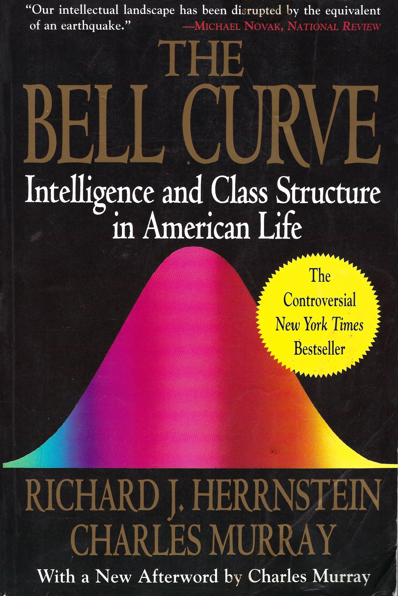
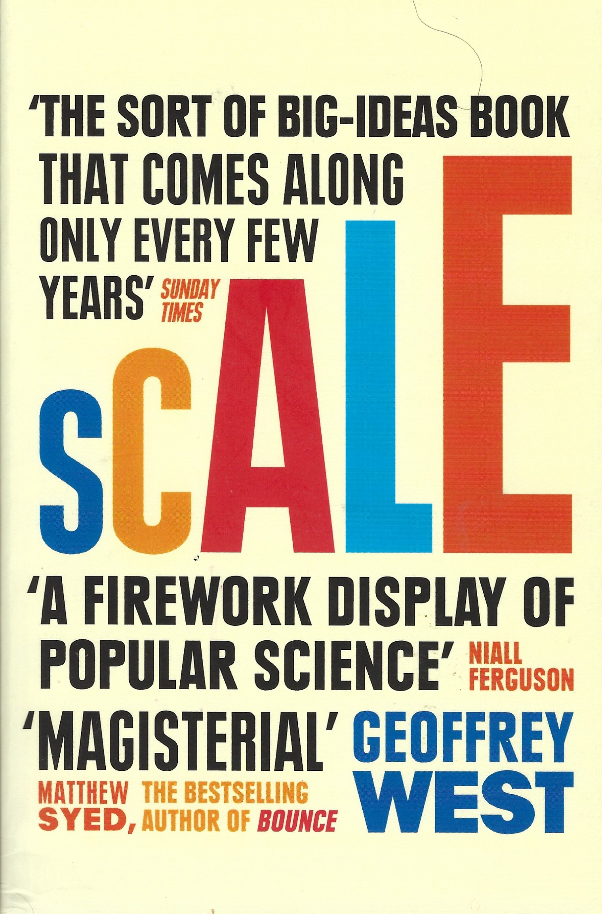
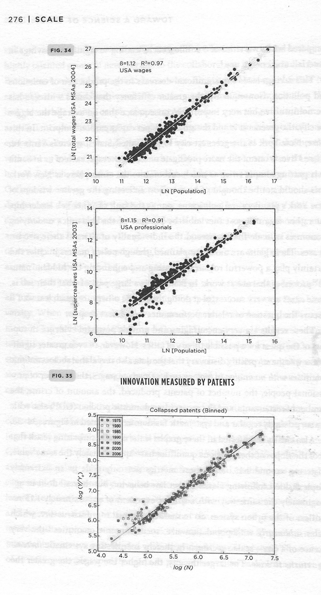
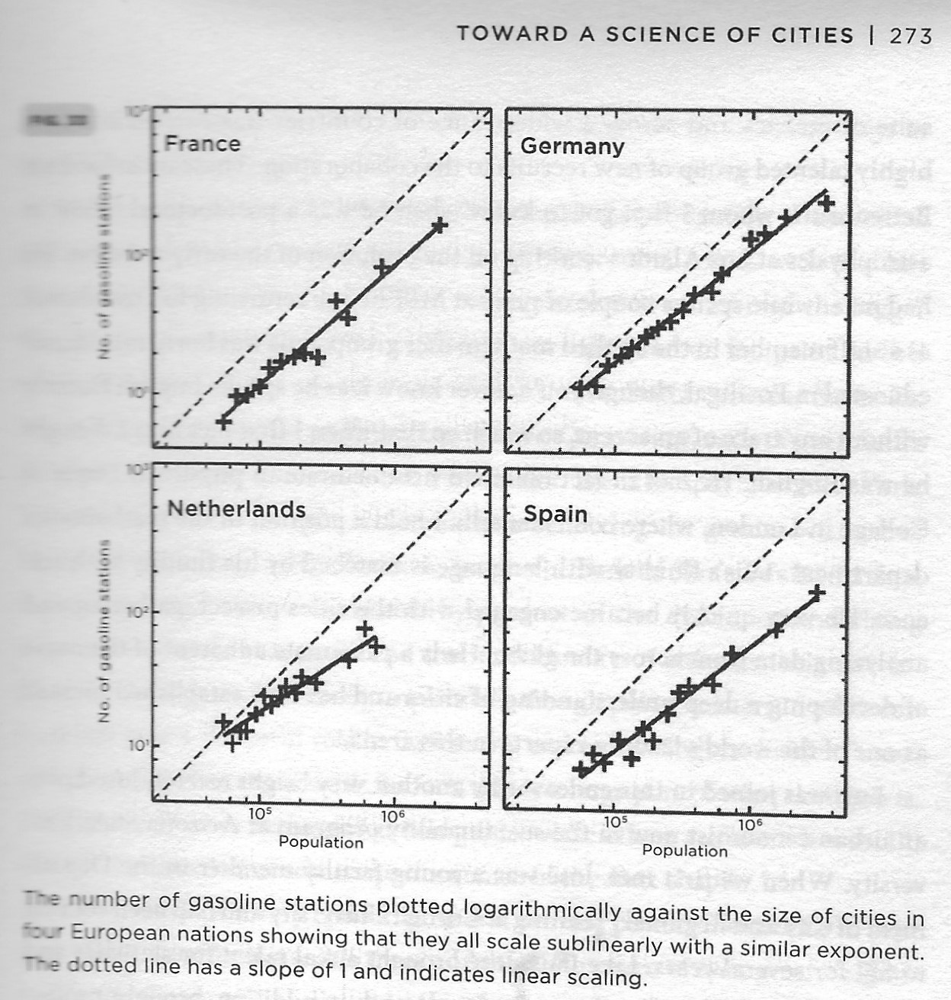
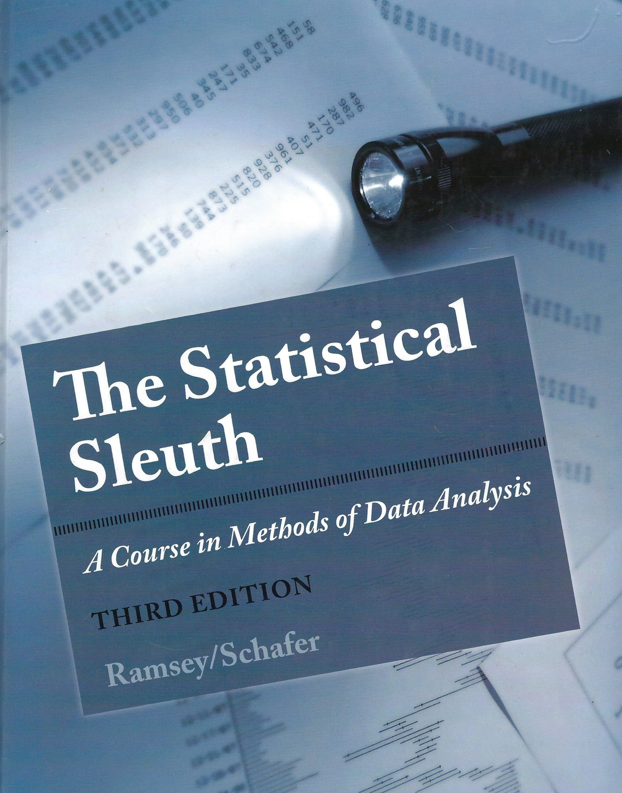
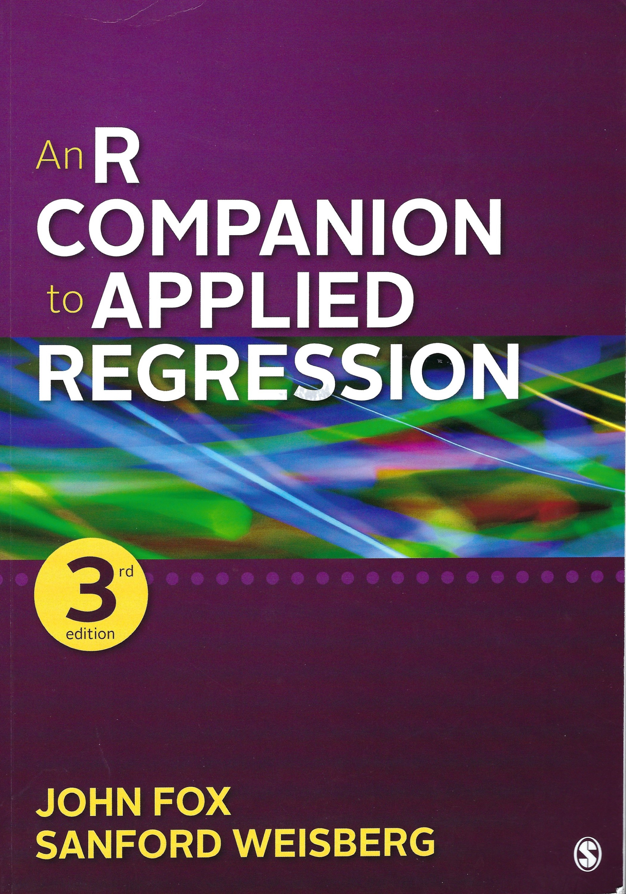
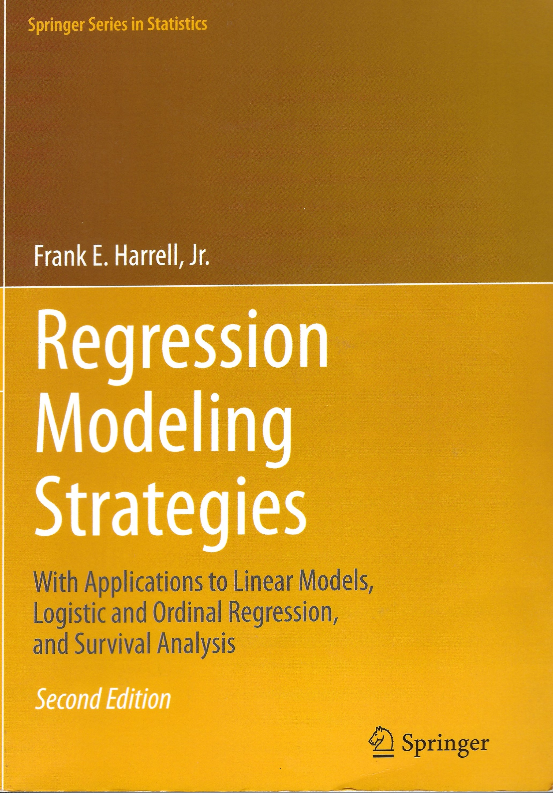

```{r setup, include=FALSE}
knitr::opts_chunk$set(echo = TRUE)
library(AICcmodavg) # for AICc()
library(car)   #for the S summary, residualPlots, InfluencePlot, dfbetas
library(lattice)  # for xyplot
library(leaps)
library(Sleuth3)

```

# Homework Solutions (5:30 PM - 6:00 PM)

## Basic 8.28 IQ, Education and Future Income (Sleuth3, p 234)

### Chloe Jackson

## Basic 9.21 Ingestion Rate of Deposit Feeders

### Jamie Beshore

## Supplemental 8.26 Kleiber's (1931) Law

### Keith Hankowsky

## HW6 Master Analysis of Ruffe Weight-Length relationships from Ogle (2016) Figs 7.2 & 7.3 

### Keith Hankowsky

## Supplemental 9.23 Compariing Male and Female Incomes After Accounting for Education and IQ

### Shibo Cao

***

## More on problems 8.28 and 9.23: Is AFQT an IQ test?

```{r, echo= FALSE, out.width='33%', fig.align='left',fig.cap='The Bell Curve (1994)'}

```

```{r, echo= FALSE, out.width='33%', fig.align='center',fig.cap='Fischer et al. (1996)'}

```

```{r, echo= FALSE, out.width='33%', fig.align='right',fig.cap='The Bell Curve Wars'}

```

## More on problems 9.21: Are deposit feeders optimal foragers?

```{r, echo= FALSE, out.width='33%', fig.align='left',fig.cap='Taghon'}

```

## More on problems 8.26: Kleiber's Law


```{r, echo= FALSE, out.width='33%', fig.align='left',fig.cap='Geoffrey West Scale'}

```


```{r, echo= FALSE, out.width='33%', fig.align='center',fig.cap='Geoffrey West Scale'}

```

```{r, echo= FALSE, out.width='33%', fig.align='right',fig.cap='Geoffrey West Scale'}

```

# Key Resources for today's class

```{r, echo= FALSE, out.width='33%', fig.align='left',fig.cap='Ramsey & Schafer (2013)'}

```

```{r, echo= FALSE, out.width='33%', fig.align='center',fig.cap='FoxWeisberg (2019)'}

```

```{r, echo= FALSE, out.width='33%', fig.align='right',fig.cap='Harrell (2015)'}

```


# Sleuth Ch 10: Inferential Tools for Multiple Regression 


***


***

## Statistical summary for Case 10.1 

* While there is evidence for a cubic term in the regression model, the quadratic model explains
99.03% of the variation in horizontal distance as a function of height.

* The cubic term explains only an additional 0.91% of the variation in horizontal distance as a function of height.

***


***

## R analysis of Case 10.1

```{r Case1001_1}
str(case1001)
attach(case1001)
```

### EXPLORATION

```{r Case1001_2}
plot(Distance ~ Height)
```

### Analysis

```{r Case1001_3}
myLm <- lm(Distance ~ Height)  
height2 <- Height^2
myLm2 <- update(myLm,  ~ . + height2)
S(myLm2, adj.r2=T)
AICc(myLm2)  # The AICc, corrected AIC small sample Akaike Information Criterion
```

#### R^2^ and Adjusted R^2^

For simple linear regression, I recommend R^2^, not adjusted R^2^. Draper & Smith (Applied Regression Analysis (1998, 2nd edition, p 139-140) spend a few paragraphs on the adjusted R^2^, dismissing it, "we do not use adjusted R^2^ in this book." Since Draper and Smith was published, the Akaike Information Criterion (AIC) and Bayesian Information Criterion (BIC) have emerged as prominent ways to assess the adequacy of multiple regression models. Each is discussed in Sleuth Ch 12 and offers ways for penalizing models which include too many parameters.  car::S can produce them for any regression.


#### AIC & AICc

* Bolker (2008, p 209-210) reviews the use of likelihood in statistical analysis and summarizes information on AIC and AICc, the Akaike Information Criterion (AIC) and the corrected AIC (AICc)

  + AIC=-2L + 2k, where L is the log-likelihood and k is the number of parameters.
  
  + AICc = AIC + (2k(k+1)/(n-k-1) and is appropriate when n/k is less than 40. 
  
* In assessing models, the smaller AIC the better the model, 

  + Models with AICc’s less than 2 apart are more or less equivalent
  
  + Models with AIC’s more than 4-7 apart are clearly distinguishable.
  
  + AIC’s are calculated in the car::S() summary function
  
  + AICc’s are calculated by AICcmodavg::AICc().

```{r Case1001_4}
height3 <- Height^3
myLm3 <- update(myLm2, ~ . + height3)
residualPlots(myLm3, smooth=T)
```

#### Influence plots (car) (Studentized residuals, hat, and Cook's D)

* Studentized residuals: how far a case is from its fitted value

  + Cases more than 2 standard errors from fitted values a concern

  + Note that large datasets will have cases with values > 2
  
* Hat values display leverage, how far a case is from the average values

  + a case with high leverage might be an outlier, but not necessarily so

  + hat values range from 0 to 1
  
  + the sum of h values equals the number of parameters in the model
  
  + the average h = (k+1)/n
  
* Cook's D measures the influence of a case on the regression
  
  + Cook's D identifies outliers that matter

  + There is no absolute standard, but large Cook's D are a problem, and Cook's D greater than 1 should be examined carefully
  
```{r Case1001_5}
influencePlot(myLm3)
```

***

#### Analysis of Studentized dfbetas (Fox & Weisberg car p. 402-403)

> dfbeta is the change in regression coefficients caused by the removal of a single case. The sdfbeta is scaled by standard error differences with and without individual cases.

```{r Case1001_6}
dfbs.myLm2 <- dfbetas(myLm2)
plot(dfbs.myLm2[,c("Height","height2")], main="Case 8.1 dfbetas")
showLabels(dfbs.myLm2[ , "Height"],
           dfbs.myLm2[ , "height2"],
          labels=rownames(myLm2), method = "r",n=2)
#         labels=rownames(myLm2), method="identify")
#         "identify" is the default, but won't work with R Markdown'
#         remember to exit from point identification mode with esc
```


```{r Case1001_7}
anova(myLm3)
S(myLm3, adj.r2=T)
AICc(myLm3)
```


### Extra sum of squares F test for the cubic model

```{r Case1001_8}
anova(myLm2,myLm3)
```

***


### An Important Note about the regression models

>Regression can be used for hypothesis testing, for modeling data, for classification, or all 3. If you want others to use the equation, it’s a model. Even regression done as hypothesis test should be treated as if others would use it as a model of the data. Frank Harrell (2015) in ‘Regression Modeling Strategies’ argues that a proper model does not have to include all of the ‘significant’ terms, nor does it have to exclude all non-significant terms (especially the Y intercept). If a model is to be used by others, non-significant terms may be exceptionally important. In the case of Galileo’s fit, the cubic term is NOT important to the regression model of gravitational effects. **Drop it.**

###  Sleuth Section 10.2.3 (p 280-281) Predict the distance at 250 punti. Code from Dalgaard p 197 identical to Sleuth Display 10.7 (p 281)

```{r Case1001_9}
pred.frame<-data.frame(cbind(Height=250,height2=250^2,height3=250^3))
pred.frame
pp<-predict(myLm2,newdata=pred.frame,interval="pred", se=T)
pp
pc<-predict(myLm2,newdata=pred.frame,interval="conf", se=T)
pc
```

### DISPLAY FOR PRESENTATION 

```{r Case1001_10}
plot(Distance ~ Height, xlab="Initial Height (Punti)",
     ylab="Horizontal Distance Traveled (Punti)",
     main="Galileo's 1609 Falling Body Experiment",
     pch=21, bg="green", lwd=2, cex=2)
dummyHeight     <- seq(min(Height),max(Height),length=100)         
betaQ           <- myLm2$coef  
quadraticCurve  <- betaQ[1] + betaQ[2]*dummyHeight + betaQ[3]*dummyHeight^2  
lines(quadraticCurve ~ dummyHeight,col="blue",lwd=3)  
betaC           <- myLm3$coef # coefficients of cubic model  
cubicCurve      <- betaC[1] + betaC[2]*dummyHeight + betaC[3]*dummyHeight^2 +
  betaC[4]*dummyHeight^3  
lines(cubicCurve ~ dummyHeight,lty=3,col="red",lwd=3) 
legend(590,390,legend=c(expression("Quadratic Fit  "*R^2*" = 99.0%"),
                        expression("Cubic Fit        "*R^2*" = 99.9%")),  
       lty=c(1,3),col=c("blue","red"), lwd=c(3,3))
detach(case1001)
```

## Energy expenditure of echolocating bats

>Do they expend more energy than non-echolocating bats or birds, after accounting for the effects of body mass on energy consumption?


***


***


***


***


***

### R Analysis of Case 10.2

#### EXPLORATION

```{r Case10.02_1}
str(case1002)
attach(case1002)
plot(Energy~Mass, case1002, log="xy", xlab = "Body Mass (g) (log scale)",
     ylab = "Energy Expenditure (W) (log scale)", 
     pch = ifelse(Type=="echolocating bats", 19,
                  ifelse(Type=="non-echolocating birds", 21, 24)))
legend(7, 50, pch=c(24, 21, 19),
       c("Non-echolocating bats", "Non-echolocating birds","Echolocating bats"))
```

#### ANALYSIS

```{r Case10.02_2}
logEnergy  <- log(Energy)
logMass <- log(Mass)
myLm2 <- lm(logEnergy ~ logMass + Type + logMass:Type)
plot(myLm2, which=1)                
myLm3 <- update(myLm2, ~ . - logMass:Type)
```

* Test for interaction effects with Extra SS F Test

```{r Case10.02_3}
anova(myLm3, myLm2)   # Test for interaction effects with extra ss F-test
```

*  No need for the interaction term.

#### INFERENCE AND INTERPRETATION

```{r Case10.02_4}
myLm4 <- update(myLm3, ~ . - Type)  # Reduced model...with no effect of Type
anova(myLm4, myLm3)   # Test for Type effect
```

* Little evidence for a type effect

* Change the reference category to test non-echolocating vs echolocating bats and non-echolocating bats vs. non-echolocating birds.

```{r Case10.02_5}
myType <- factor(Type,
levels=c("non-echolocating bats","echolocating bats","non-echolocating birds"))
myLm3a <- lm(logEnergy ~ logMass + myType) 
summary(myLm3a)
100*(exp(myLm3a$coef[3]) - 1) 
100*(exp(confint(myLm3a,3))-1)
```

#### STATISTICAL CONCLUSIONS

* Adjusted for body mass, the median energy expenditure for echo-locating bats exceeds that for non-echolocating bats by an estimated 8.2% (95% confidence interval: 29.6% less to 66.3% more)

#### Special topic, not in Sleuth. Non-integer categorical or dummy variables. This topic is covered in more depth in Draper & Smith's Applied Regression analysis

```{r Case10.02_6}
BirdvBat<-c(rep(-1/2,4),rep(1,12),rep(-1/2,4))
BatvBat<-c(rep(-1/2,4),rep(0,12),rep(1/2,4))
nebirdsvnebats<-c(rep(0,4),rep(-1/2,12),rep(1/2,4))
echobatsvsnonecho<-c(rep(1,4),rep(-1/2,12),rep(-1/2,4)) #echo bats - nonecholocating bats
case1002$BirdvBat<-BirdvBat
case1002$BatvBat<-BatvBat
myLm5 <- lm(logEnergy ~ logMass + BirdvBat + BatvBat)
S(myLm5)
myLm6<-lm(logEnergy ~ logMass + nebirdsvnebats+echobatsvsnonecho)
S(myLm6)
```

#### DISPLAY FOR PRESENTATION

```{r Case10.02_7}
myPlotCode    <- ifelse(Type=="non-echolocating birds",24,21)        
myPointColor  <- ifelse(Type=="echolocating bats","green","white")  
plot(Energy ~ Mass, log="xy", xlab="Body Mass (g); Log Scale ",
     ylab="In-Flight Energy Expenditure (W); Log Scale",
     main="In-Flight Energy Expenditure Study",
     pch=myPlotCode,bg=myPointColor,lwd=2, cex=1.5) 
dummyMass  <- seq(5,800,length=50)
beta       <- myLm3$coef
curve1     <- exp(beta[1] + beta[2]*log(dummyMass))
curve2     <- exp(beta[1] + beta[2]*log(dummyMass) + beta[3])
curve3     <- exp(beta[1] + beta[2]*log(dummyMass) + beta[4])
lines(curve1 ~ dummyMass)
lines(curve2 ~ dummyMass, lty=2)
lines(curve3 ~ dummyMass, lty=3)
legend(100,3,
       c("Echolocating Bats","Non-Echolocating Bats","Non-Echolocating Birds"),
       pch=c(21,21,24),lwd=2,pt.cex=c(1.5,1.5,1.5),pt.lwd=c(2,2,2),
       pt.bg=c("green","white","white"),lty=c(1,2,3))
detach(case1002)
```


***


***


***

# Chapter 11 Model Checking & Refinement

## Case Study 11.1 Alcohol Metaboilsm in Men and Women---An Observational Study

* 18 Men & 14 women volunteers from Trieste FR: 3 women & 5 men were alcoholic
  
* Ethanol dose 0.3 g/kg orally one day & intravenously another: Randomly determined order

* Intravenous-oral= 1st pass metabolism

* Gastric alcohol dehydrogenase activity measured


***

### RESEARCH QUESTIONS

* Do levels of first-pass metabolism differ between men and women?

* Can differences be explained by postulating that men have more alcohol dehydrogenase activity in their stomachs?

* Are these effects complicated by an alcoholism effect (3 women & 5 men were alcoholics)?


***


***

### Regression diagnostics: Determining which single observations might be outliers

#### Leverage: Unusual explanatory variables


***

#### Cook's D: Outliers that matter

* There is no critical value for Cook’s D, but D ≥ 1 of concern; D less than 1 could be important too.

* Calculation of Cook's D is equivalent to performing the regression after deleting each case, one at a time

  + The actual cases need not be deleted. See equation in Sleuth bottom page 319
  
  + Cook’s D = *f*(studentized residual & leverage)
  
  + D estimates the change in parameters with and without the deleted case
  
* A point with high leverage need not affect Cook's D

#### Sdfbeta

* Not in Sleuth, but one of the best diagnostics.

* The change in standard errors of each parameter estimate caused by the deletion of each case

* influence.measures() in R


### R Code for Case Study 11.1

```{r case1101_1}
str(case1101)
attach(case1101)
```

#### EXPLORATION

```{r case1101_2}
xyplot(Metabol~Gastric|Sex*Alcohol, case1101)  # From trellis package
myPch <- ifelse(Sex=="Female",24,21)
myBg  <- ifelse(Alcohol=="Alcoholic","gray","white")
plot(Metabol~Gastric, pch=myPch,bg=myBg,cex=1.5)
legend(1,12, pch=c(24,24,21,21), pt.cex=c(1.5,1.5,1.5,1.5),
       pt.bg=c("white","gray", "white", "gray"),
       c("Non-alcoholic Females", "Alcoholic Females",
         "Non-alcoholic Males", "Alcoholic Males"))                               
identify(Metabol ~ Gastric, n=2)
```

There are two apparent odd cases

#### Analyze full model with interactions

```{r case1101_3}
myLm1 <- lm(Metabol ~ Gastric + Sex + Gastric:Sex)  
plot(myLm1, which=1)                                
plot(myLm1, which=4) # Show Cook's Distance; note cases 31 and 32.
plot(myLm1, which=5) # Note leverage and studentized residual for cases 31 and 32.
subject  <- 1:32  # Create ID number from 1 to 32
dfbs.case1101<-dfbetas(myLm1) # See car p. 301 for dfbetas plot
head(dfbs.case1101)  # display first few rows
plot(dfbs.case1101[ , c("Gastric", "SexMale")], 
     main="dfbetas plot") # for b1 and b2
identify(dfbs.case1101[ ,"Gastric"],dfbs.case1101[ ,"SexMale"])
# in the non knitted code, this would allow the mouse to flag 31 & 32, followed
# by hitting esc
plot(dfbs.case1101[ , c("SexMale", "Gastric:SexMale")], 
     main="dfbetas plot") # for b1 and b2
identify(dfbs.case1101[ ,"SexMale"],dfbs.case1101[ ,"Gastric:SexMale"])
# in the non knitted code, this would allow the mouse to flag 31 & 32, followed
# by hitting esc
```

Case 31 & 32 are outliers according to sdfbeta plot.

Refit model without cases 31 and 32:

```{r case1101_4}
myLm2 <- update(myLm1, ~ ., subset = (subject !=31 & subject !=32))      
plot(myLm2,which=1)
plot(myLm2,which=4)
plot(myLm2,which=5)
summary(myLm1)                                                                   
summary(myLm2)
myLm3 <- update(myLm2, ~ . - Gastric:Sex) #Drop interaction (without 31,32).
summary(myLm3)
```

The need for the interaction term hinges on cases 31 and 32, so delete the interaction term. Plot car partial residual plots: crPlots

```{r case1101_5}
crPlots(myLm3) # Show partial residual (component + residual) plots.
```

#### INFERENCE AND INTERPRETATION

```{r case1101_6}
# Use car S summary
S(myLm3)
confint(myLm3,2:3)
```

#### DISPLAY FOR PRESENTATION 

```{r case1101_7}
myCol <- ifelse(Sex=="Male","blue","red")
plot(Metabol ~ Gastric,  
     xlab=expression("Gastric Alcohol Dehydrogenase Activity in Stomach ("*mu*"mol/min/g of Tissue)"), 
     ylab="First-pass Metabolism in the Stomach (mmol/liter-hour)",
     main="First-Pass Alcohol Metabolism and Enzyme Activity", 
     pch=myPch, bg=myBg,cex=1.75, col=myCol, lwd=1)
legend(0.8,12.2, c("Females", "Males"), lty=c(1,2),
       pch=c(24,21), pt.cex=c(1.75,1.75), col=c("red", "blue"))
dummyGastric <- seq(min(Gastric),3,length=100)
beta <- myLm3$coef
curveF <- beta[1] + beta[2]*dummyGastric
curveM <- beta[1] + beta[2]*dummyGastric + beta[3]
lines(curveF ~ dummyGastric, col="red")
lines(curveM ~ dummyGastric, col="blue",lty=2)
text(.8,10,"gray indicates alcoholic",cex = .8, adj=0)
detach(case1101)
```


***


***


#### Gallagher's Final Model. Sleuth3 model breaks 2 important rules

* Rules described in Draper & Smith (1994), Harrell (2015), Venables & Ripley and the R code itself which automatically inserts main effects when interaction term included

* Always include the Y intercept

* Always include the main effect (gender) if the interaction term is in the model

```{r}
S(myLm3)
```

### Caveat on conclusion that men have a higher first-pass metabolism

>The regression artefact is one of the major causes of errors in interpreting regression analysis. Men had higher activities of gastric alcohol dehydrogenase. As Campbell & Kenny (1999) show in their book, if there is less than a perfect correlation between gastric alcohol dehydrogenase activity and first-pass metabolism, then a gender effect for first-pass metabolism may be caused by regression to the mean.

## Case 11.2 The Blood-Brain Barrier---A Controlled Experiment


***


***


***


***


### R Code for Case 11.2

####EXPLORATION

```{r case 11.2_1}
attach(case1102)
logRatio <- log(Brain/Liver)
logTime <- log(Time)
myMatrix <- cbind (logRatio, Days, Weight, Loss, Tumor, logTime, Treatment)
scatterplotMatrix(myMatrix,groups=Treatment,
                  smooth=FALSE, diagonal="histogram", col=c("green","blue"),
                  pch=c(16,17), cex=1.5)
# The figure is way too busy
```

#### Fit tentative model with log(Time)

```{r case 11.2_2}
myLm1 <- lm(logRatio ~ Treatment + logTime + Days + Sex + Weight + Loss + Tumor)
plot(myLm1, which=1)
```

#### Analyze diagnostic plots

```{r case 11.2_3}
crPlots(myLm1) # Draw partial residual plots from car, using log(time)
```

#### Model time as a factor, not continuous

```{r case 11.2_4}
myLm2   <-  lm(logRatio ~ Treatment + factor(Time) + 
                 Days + Sex + Weight + Loss + Tumor)  # Include Time as a factor.
```


```{r case 11.2_5}
anova(myLm1,myLm2)
```

Extra sum of squares F test indicates that Time as a factor explains more variation than log(Time)

#### Analyze diagnostic plots & perform a backward elimination to simplify the model

```{r case 11.2_6}
crPlots(myLm2) # Draw partial resdual plots. 
S(myLm2)  # Use backward elimination, results from car S()
AICc(myLm2)
```

Eliminate Days from the model

```{r case 11.2_7}
myLm3 <- update(myLm2, ~ . - Days)   
S(myLm3)
AICc(myLm3)
```

Eliminate Sex from the model

```{r case 11.2_8}
myLm4 <- update(myLm3, ~ . - Sex)          
S(myLm4)
AICc(myLm4)
```

Eliminate weight from the model 

```{r case 11.2_9}
myLm5 <- update(myLm4, ~ . - Weight)
S(myLm5)
AICc(myLm5)
```

Eliminate Tumor from the model

```{r case 11.2_10}
myLm6 <- update(myLm5, ~ . - Tumor)
S(myLm6)
AICc(myLm6)
```

Eliminate Loss from the model, producing the final model

```{r case 11.2_11}
myLm7 <- update(myLm6, ~ . - Loss)
S(myLm7)   # Final model for inference
AICc(myLm7)
# The AICc indicates the final model has the highest likelihood, after
# penalization for the number of variables.
```

#### INFERENCE AND INTERPRETATION

```{r case 11.2_12}
myTreatment <- factor(Treatment,levels=c("NS","BD")) # Change level ordering 
myLm7a  <- lm(logRatio ~  factor(Time) + myTreatment)
summary(myLm7a) 
beta <- myLm7a$coef
exp(beta[5])         
exp(confint(myLm7a,5))
```

Interpetation: The median ratio of brain to liver tumor counts for barrier-disrupted rats is estimated to be 2.2 times the median ratio for control rats (95% CI: 1.5 times to 3.2 times as large).

#### DISPLAY FOR PRESENTATION 

```{r case 11.2_13}
ratio <- Brain/Liver
jTime <- exp(jitter(logTime,.2)) # Back-transform a jittered version of logTime
plot(ratio ~ jTime, log="xy",
     xlab="Sacrifice Time (Hours), jittered; Log Scale",
     ylab="Effectiveness: Brain Tumor Count Relative To Liver Tumor Count; Log Scale",
     main="Blood Brain Barrier Disruption Effectiveness in 34 Rats", 
     pch= ifelse(Treatment=="BD",21,24), bg=ifelse(Treatment=="BD","green","orange"),
     lwd=2, cex=2)
dummyTime     <- c(0.5, 3, 24, 72)
controlTerm   <- beta[1] + beta[2]*(dummyTime==3) + 
  beta[3]*(dummyTime==24) + beta[4]*(dummyTime==72)
controlCurve  <- exp(controlTerm)
lines(controlCurve ~ dummyTime, lty=1,lwd=2)
BDTerm        <- controlTerm + beta[5]
BDCurve       <- exp(BDTerm)
lines(BDCurve ~ dummyTime,lty=2,lwd=2)
legend(0.5,10,c("Barrier disruption","Saline control"),pch=c(21,22),
       pt.bg=c("green","orange"),pt.lwd=c(2,2),pt.cex=c(2,2), lty=c(2,1),lwd=c(2,2))
detach(case1102)
```

***


***

##  Conclusions from Chapter 11

* Regression equations are used to both test hypotheses and to model data

* Properly identifying and deleting influential observations is often required to obtain adequate regression models; restricting the range of applicability is one solution

* Statistics to detect influential cases

  + Leverage (often measured with the hat statistic indicates how ‘different’ a case is relative to other explanatory variables.
  
  + Influence statistics include:
    
    - Leverage (1/n < leverage; Average = p/n; Potential cutoff: leverage > 2p/n)
  
    - Cook’s D (Cook’s D > 1 used by most as a flag)
    
    - Studentized residuals (internal, or external {deleted})
    
    - DFBeta & SDFBeta (SDFBeta: 2 standard errors as a flag)
    
# Chapter 12: Strategies for Variable Selection, the Regression Artifact & Other Regression Fallacies

## Don't use multiple regression with automated selection procedures (Harrell 2015, section 4.3)

> “Being in politics is like being a football coach. You have to be smart enough to understand
the game and dumb enough to think it's important.”-- Eugene McCarthy 

> 'To use multiple regression to test causal models with automated selection, you have to know
enough statistics to run the analysis, but you have to be dumb enough to think the approach is valid.' Gallagher's paraphrase of Harrell

## Does fluoride cause cancer?


* Yiamouyiannis & Burk 1977 reviewed by Manly (1992)

  + Fluoridation began in 1952-1956
  
  + Fluoridated and non-fluoridated cities matched by population size
  
  + 10 largest non-fluoridated and fluoridated cities
  
  + Similar 1950 death rates


***


***


***

## Case 12.1 State SAT Scores---An Observational Study


***

### Conclusions from analysis of SAT scores

* 81.5% of SAT Score Variation a function of  % Students Taking exam & median class rank

* Convincing evidence that state expenditure and years of formal study affect SAT scores

* After covariates included in model, NH is #1 for ‘value added’, Massachusetts is 11 (student representation) or 32 (expenditure)


***


***


***


***


***

## Harrell's (2015) Critique of automated selection procedures

* They yield R^2^ values that are biased high

* F and χ^2^ distributions don’t have their claimed distributions

* SE of regression coefficients are biased low and CI’s and predicted values that are falsely narrow

* P-values too small (enhanced P(Type I error), false positives)

* Regression coefficients biased high in absolute value and need shrinkage.

* Rather than solving the problem of collinearity, variable selection is made arbitrary by collinearity

* It allows us not to think about the problem

## Harrell (2015) on Overfitting

> “When a model is fitted that is too complex, that is it has too many free parameters to
estimate for the amount of information in the data, the worth of the model (e.g., R2) will be
exaggerated and future observed values will not agree with predicted values. In this situation
overfitting is said to be present, and some of the findings of the analysis come from fitting
noise or finding spurious associations between X and Y”


# Phillip Dugger's Ph.D. using spikeSlabGAM: https://cran.r-project.org/web/packages/spikeSlabGAM/index.html

Phillip used this Bayesian selection procedure to select the climate variables and the temporal lags most closely associated with rainforest tree phenology. I told him to try random numbers, and he did try it. The model was not fooled by randomness:
Model:
data_r1 ~ fct(fct1) * fct(data_v1) + fct(fct1) * fct(data_v2) + 
    fct(fct1) * fct(data_v3) + fct(fct1) * fct(data_v4) + fct(fct1) * 
    fct(data_v1_lag3) + fct(fct1) * fct(data_v2_lag3) + fct(fct1) * 
    fct(data_v3_lag3) + fct(fct1) * fct(data_v4_lag3) + fct(fct1) * 
    fct(data_v1_lag6) + fct(fct1) * fct(data_v2_lag6) + fct(fct1) * 
    fct(data_v3_lag6) + fct(fct1) * fct(data_v4_lag6) + fct(fct1) * 
    fct(ym_num) + fct(fct1) * fct(month)
<environment: 0x000002968fb28968>
849 observations; 1741 coefficients in 30 model terms.
 
Prior:
    a[tau]     b[tau]       v[0]       a[w]       b[w] a[sigma^2] b[sigma^2] 
   5.0e+00    2.5e+01    2.5e-04    1.0e+00    1.0e+00    1.0e-04    1.0e-04 
 
MCMC:
Saved 1500 samples from 3 chain(s), each ran 2500 iterations after a burn-in of 100 ; Thinning: 5
 
                             
Null deviance:           2436
Mean posterior deviance: 2425
 
Marginal posterior inclusion probabilities and term importance:
                            P(gamma = 1)    pi dim  
u                                     NA    NA   1  
fct(fct1)                          0.003 0.035   2  
fct(data_v1)                       0.005 0.009  48  
fct(data_v2)                       0.003 0.008  45  
fct(data_v3)                       0.004 0.009  45  
fct(data_v4)                       0.014 0.021  52  
fct(data_v1_lag3)                  0.003 0.005  48  
fct(data_v2_lag3)                  0.003 0.005  45  
fct(data_v3_lag3)                  0.006 0.010  45  
fct(data_v4_lag3)                  0.003 0.004  52  
fct(data_v1_lag6)                  0.004 0.007  48  
fct(data_v2_lag6)                  0.006 0.008  46  
fct(data_v3_lag6)                  0.003 0.011  45  
fct(data_v4_lag6)                  0.004 0.015  52  
fct(ym_num)                        0.004 0.012 282  
fct(month)                         0.002 0.009  11  
fct(fct1):fct(data_v1)             0.004 0.000  48  
fct(fct1):fct(data_v2)             0.006 0.019  45  
fct(fct1):fct(data_v3)             0.103 0.278  45  
fct(fct1):fct(data_v4)             0.029 0.084  52  
fct(fct1):fct(data_v1_lag3)        0.005 0.011  48  
fct(fct1):fct(data_v2_lag3)        0.005 0.006  45  
fct(fct1):fct(data_v3_lag3)        0.011 0.008  45  
fct(fct1):fct(data_v4_lag3)        0.024 0.087  52  
fct(fct1):fct(data_v1_lag6)        0.017 0.106  48  
fct(fct1):fct(data_v2_lag6)        0.004 0.001  46  
fct(fct1):fct(data_v3_lag6)        0.010 0.087  45  
fct(fct1):fct(data_v4_lag6)        0.007 0.005  52  
fct(fct1):fct(ym_num)              0.006 0.124 281  
fct(fct1):fct(month)               0.003 0.016  22  
*:P(gamma = 1)>.25 **:P(gamma = 1)>.5 ***:P(gamma = 1)>.9

# Chris Franck's An Introduction to Model Uncertainty and Averaging for Categorical Data Analysis

## Used BIC and the BAS package. This method seems to work for automated variable selection

<https://cran.r-project.org/web/packages/BAS/vignettes/BAS-vignette.html>

## Burnham has an article out decrying the use of AIC & BIC in automated model selection. Harrell is opposed as well.


## Multicolinearity among explanatory variables

* If the explanatory variables are strongly correlated

  + The regression coefficient estimates have a huge variance
  
  + They can change in sign and significance with a slight change in the data: “bouncing Betas”

* Assessed with Variance inflation factors (VIF) or tolerance

  + VIF~i~ = 1 (1- R^2^~i~), where R^2^~i~ is the squared multiple correlation coefficient between explanatory variable ‘i’ and the other explanatory variables
  
  + car::vif() in R
  
  + Neter et al. (1996): VIF’s > 10 are cause for concern (but smaller VIF’s can also be a problem)
  
  + Marayuma (1998): VIF> 6 or 7, as a very rough rule, indicate strong multicollinearity
  
### How to detect multicollinearity

* When the variance (standard errors) of beta weights is large

* When signs on beta weights are inappropriate [e.g., larger classes ⇨ higher test scores; more Cu ⇨ higher biodiversity]

* When regression weights and signs change radically upon the addition or removal of single variables 

* When the Variance Inflation Factor is high (VIF> 6 or 7 as a very rough rule)

* When simple correlations among predictors are > 0.8-0.9 

* When correlations among predictor variables > R^2^ for response with all predictor variables

> If the goal of the model is to produce predicted values for one regression, then multicollinearity is not a problem.  All variables can be included. However, if the regression is to be used for modeling new data, then the model will be badly overfitted and the predicted values will be biased. Significant coefficients could be spurious or nonsense.

*** 

```{r}
attach(case1202)

## EXPLORATION
logSal <- log(Bsal)    
myMatrix <- cbind (logSal, Senior,Age, Educ, Exper)   
scatterplotMatrix(myMatrix, smooth=FALSE, diagonal="histogram",
                    groups=Sex, col=c("red","blue") )   

myLm1 <- lm(logSal ~ Senior + Age + Educ + Exper + Sex)
plot(myLm1, which=1)           
plot(myLm1, which=4) #  Cook's Distance 
crPlots(myLm1)    # Partial residual plots

ageSquared    <- Age^2   
ageCubed      <- Age^3     
experSquared  <- Exper^2
experCubed    <- Exper^3
myLm2 <- lm(logSal ~ Senior + Age + ageSquared  + ageCubed + 
              Educ + Exper + experSquared + experCubed  + Sex)
plot(myLm2, which=1)  # Residual plot         
plot(myLm1, which=4)  # Cook's distance
# No evident problem with outliers.

# Note: this automatic selection is a terrible idea (see Harrell 2015)

  mySubsets     <- regsubsets(logSal ~ (Senior + Age + Educ + Exper + 
                    ageSquared  + experSquared)^2, nvmax=25, data=case1202)    
  mySummary  <- summary(mySubsets)    
  p  <- apply(mySummary$which, 1, sum)     
  plot(mySummary$bic ~ p, ylab = "BIC")            
  cbind(p,mySummary$bic)  
  mySummary$which[8,]  # Note that Age:ageSquared = ageCubed

myLm3         <- lm(logSal ~ Age + Educ + ageSquared + Senior:Educ + 
                      Age:Exper + ageCubed + Educ:Exper + Exper:ageSquared) 
summary(myLm3)

myLm4 <- update(myLm3, ~ . + Sex)  
summary(myLm4)                                                                   
myLm5 <- update(myLm4, ~ . + Sex:Age + Sex:Educ + Sex:Senior + 
                  Sex:Exper + Sex:ageSquared)
anova(myLm4, myLm5) 

## INFERENCE AND INTERPRETATION
summary(myLm4)
beta          <- myLm4$coef  
exp(beta[6])             
exp(confint(myLm4,6))    
# Conclusion:  The median beginning salary for males was estimated to be 12% 
# higher than the median salary for females with similar values of the available 
# qualification variables (95% confidence interval: 7% to 17% higher).

## DISPLAY FOR PRESENTATION        
years <- Exper/12  # Change months to years
plot(Bsal ~ years, log="y", xlab="Previous Work Experience (Years)",
     ylab="Beginning Salary (Dollars); Log Scale",
     main="Beginning Salaries and Experience for 61 Female and 32 Male Employees",
     pch= ifelse(Sex=="Male",24,21), bg = "gray", 
     col= ifelse(Sex=="Male","blue","red"), lwd=2, cex=1.8 )
myLm6 <- lm(logSal ~ Exper + experSquared + experCubed + Sex)
beta <- myLm6$coef
dummyExper <- seq(min(Exper),max(Exper),length=50)
curveF <- beta[1] + beta[2]*dummyExper + beta[3]*dummyExper^2 +
  beta[4]*dummyExper^3 
curveM <- curveF + beta[5]
dummyYears <- dummyExper/12
lines(exp(curveF) ~ dummyYears, lty=1, lwd=2,col="red")
lines(exp(curveM) ~ dummyYears, lty = 2, lwd=2, col="blue")                                                                     
legend(28,8150, c("Male","Female"),pch=c(24,21), pt.cex=1.8, pt.lwd=2, 
       pt.bg=c("gray","gray"), col=c("blue","red"), lty=c(2,1), lwd=2) 

detach(case1202)
```


# Conclusions on the regression artifact & multicollinearity

* Regression to the mean, the regression artifact, will be present whenever an explanatory variable (covariate) exhibits less than perfect correlation with the response variable. The lower the correlation, the more the regression artifact.

* One can NOT make causal inferences about the effects of a covariate based on the sign of the coefficient II.Multicollinearity can cause significant causal factors to be dropped and noncausal factors to be retained III.The problem of overfitting and multicollinearity is made worse by the use of automated selection procedures

* For pre-test vs.Post-test analyses, regressing with pretest score as an explanatory variable DOES NOT remove the effects of pre-test differences 

** If there is less than a perfect correlation between the response and covariate, the RTM effect will
be present 

** Better approaches: Repeated measures designs, mixed-model designs, including multilevel longitudinal models or subtract pretest from posttest (called change score analysis) or use James-Stein estimators

***

